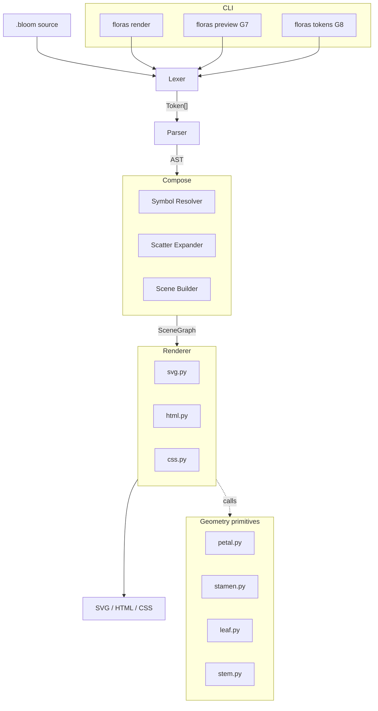
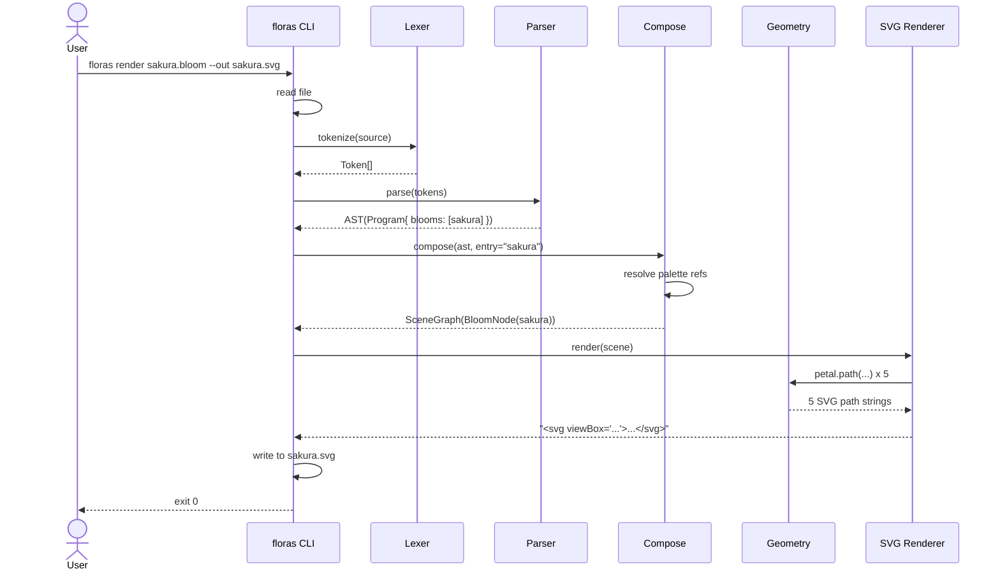
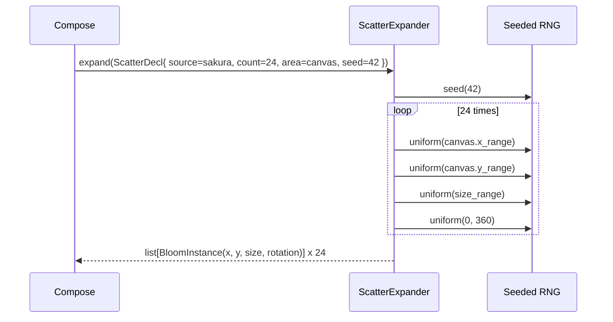
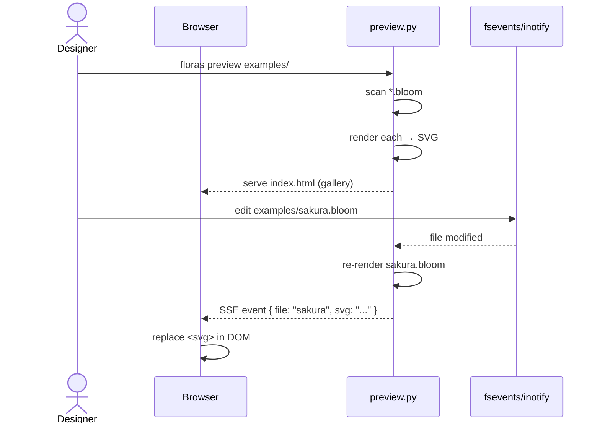

# Floras Bloom DSL — Design

| 項目 | 値 |
|------|-----|
| Status | Draft / In Review / **Approved** |
| Author | yuuto |
| Last Updated | 2026-05-07 |
| Approved On | 2026-05-07 |
| Requirements | ./requirements.md |

## Architecture Overview

**3 段の純粋関数パイプライン** + **1 つのプリザーブ可能な中間表現 (SceneGraph)**。

```
.bloom source
   │
   ▼  Lexer (tokens.py / lexer.py)
Token[]
   │
   ▼  Parser (parser.py)
AST  (Program with palette/bloom/motif/bouquet decls)
   │
   ▼  Compose (compose/resolver.py + scatter.py + scene.py)
SceneGraph  (resolved, deterministic, no symbol refs)
   │
   ▼  Render (render/svg.py | html.py | css.py)
output  (SVG file | HTML preview | CSS tokens)
```



設計原則:
- **段階間は純粋関数**: Lexer / Parser / Compose / Renderer は副作用ゼロ。CLI 層がのみ I/O を担う。
- **SceneGraph は決定論的中間表現**: scatter は compose 段階で展開され、ランダム要素は SceneGraph 構築完了時点で確定。後段 (renderer) はランダム性を持たない。
- **Renderer はバックエンド差し替え可能**: SVG / HTML / CSS / (将来) PDF / Canvas は同じ SceneGraph を入力にする。
- **Geometry は計算純粋**: Petal / Stamen / Leaf / Stem の SVG path 文字列を返す純粋関数。

## Sequence: 単一 bloom render（AC-01-1）



## Sequence: scatter 展開（AC-05-1）



## Sequence: preview ライブリロード（AC-07-2）



## Data Model

### Token (再利用 / 旧 spec から流用)
```python
# floras/tokens.py
class TokenKind(StrEnum):
    # Atoms
    NUMBER = "NUMBER"          # 42, 3.14
    PERCENT = "PERCENT"        # 50%
    PIXEL = "PIXEL"            # 12px
    DEG = "DEG"                # 90deg
    TURN = "TURN"              # 0.25turn
    HEX_COLOR = "HEX_COLOR"    # #FFB7C5
    OKLCH = "OKLCH"            # oklch(...)
    STRING = "STRING"          # bara_kuchi ... bara_tojiru (legacy) or "..."  (見直し: D-02 では plain "...")
    IDENT = "IDENT"
    # Punctuation
    LBRACE = "{"; RBRACE = "}"
    LPAREN = "("; RPAREN = ")"
    SEMI = ";"; COMMA = ","
    DOT = "."; DOTDOT = ".."
    X_TOKEN = "x"              # 1200 x 630 用予約 (pseudo-keyword)
    # Top-level keywords
    PALETTE = "palette"
    BLOOM = "bloom"
    MOTIF = "motif"
    BOUQUET = "bouquet"
    EXPORT = "export"
    # Statement keywords
    CANVAS = "canvas"; BACKGROUND = "background"
    PLACE = "place"; AT = "at"
    SCATTER = "scatter"; SOURCE = "source"; COUNT = "count"
    AREA = "area"; SEED = "seed"
    SIZE = "size"; ROTATION = "rotation"
    COLOR = "color"; STROKE = "stroke"
    WIDTH = "width"; HEIGHT = "height"
    FROM = "from"; TO = "to"
    PETALS = "petals"
    PETAL_WIDTH = "petal-width"; PETAL_HEIGHT = "petal-height"
    PETAL_CURL = "petal-curl"; PETAL_NOTCH = "petal-notch"
    STAMEN_COUNT = "stamen-count"; STAMEN_RADIUS = "stamen-radius"; STAMEN_COLOR = "stamen-color"
    STEM = "stem"; STEM_LENGTH = "stem-length"; STEM_COLOR = "stem-color"
    LEAF_COUNT = "leaf-count"
    ARRANGE = "arrange"; TINTED = "tinted"
    # Area sub-keywords
    RING = "ring"; RECT = "rect"; GRID = "grid"; PATH = "path"
    # Arrange sub-keywords
    SPIRAL = "spiral"
    # Built-in constants
    CENTER = "center"; AUTO = "auto"; RANDOM = "random"
    TRUE = "true"; FALSE = "false"; NONE = "none"
    # Comment marker (consumed by lexer, no token emitted)
    SHION = "shion"
    # Meta
    COLS = "cols"; ROWS = "rows"
    INNER = "inner"; OUTER = "outer"
    EOF = "EOF"
```

### AST Nodes
```python
# floras/ast_nodes.py — 概略
from dataclasses import dataclass
from typing import Union

# Top-level
@dataclass
class Program:
    palettes: list["PaletteDecl"]
    blooms: list["BloomDecl"]
    motifs: list["MotifDecl"]
    bouquets: list["BouquetDecl"]
    line: int = 1

@dataclass
class PaletteDecl:
    name: str                          # "brand"
    tokens: dict[str, "ColorValue"]    # {"500": HexColor("#FFB7C5"), ...}
    line: int

@dataclass
class BloomDecl:
    name: str
    properties: dict[str, "Value"]     # petals, size, color, etc.
    line: int

@dataclass
class MotifDecl:
    name: str
    placements: list["Placement"]      # 子要素の宣言（place / line / scatter）
    line: int

@dataclass
class BouquetDecl:
    name: str
    canvas: "CanvasDecl"
    background: "ColorValue | None"
    items: list[Union["Placement", "ScatterDecl"]]
    line: int

@dataclass
class CanvasDecl:
    width: float; height: float; line: int

@dataclass
class Placement:                       # `place <name> at (x, y) size N rotation D color C`
    target: str                         # bloom or motif name
    x: "Coord"; y: "Coord"             # Coord = float | "center"
    size: "Value | None"
    rotation: "Value | None"
    color: "ColorValue | None"
    line: int

@dataclass
class ScatterDecl:
    source: str                         # bloom or motif name
    count: int | str                    # int or "auto"
    area: "AreaSpec"
    size: "Range | float | None"
    rotation: "Value | None"
    color: "ColorValue | None"
    seed: int
    line: int

# Area specs
@dataclass
class AreaCanvas: ...
@dataclass
class AreaRing:
    center_x: float; center_y: float; inner: float; outer: float
@dataclass
class AreaRect:
    x1: float; y1: float; x2: float; y2: float
@dataclass
class AreaGrid:
    cols: int; rows: int

AreaSpec = Union[AreaCanvas, AreaRing, AreaRect, AreaGrid]

# Values
@dataclass
class NumberValue: value: float
@dataclass
class PercentValue: value: float        # 50% → 0.5
@dataclass
class AngleValue: degrees: float
@dataclass
class Range: min: float; max: float
@dataclass
class HexColor: hex: str
@dataclass
class OklchColor: l: float; c: float; h: float
@dataclass
class PaletteRef: palette: str; token: str; tint: tuple[str, str, float] | None = None  # ("paper", 0.3) で tinted
@dataclass
class IdentValue: name: str             # "center", "auto", "random", or user identifier

Value = Union[NumberValue, PercentValue, AngleValue, Range, HexColor, OklchColor, PaletteRef, IdentValue]
ColorValue = Union[HexColor, OklchColor, PaletteRef]
Coord = Union[float, IdentValue]        # IdentValue("center") only
```

### SceneGraph (compose 後の決定論的中間表現)
```python
# floras/compose/scene.py
@dataclass(frozen=True)
class Scene:
    canvas: tuple[float, float]         # (width, height)
    background: HexColor | None
    items: tuple["SceneItem", ...]      # 描画順

@dataclass(frozen=True)
class BloomInstance:
    bloom_name: str
    x: float; y: float
    size: float
    rotation: float                     # degrees
    color: HexColor                     # palette/tint 全て解決済
    petals: int
    petal_width: float; petal_height: float
    petal_curl: float; petal_notch: float
    stamen_count: int; stamen_radius: float; stamen_color: HexColor
    stem: bool
    stem_length: float; stem_color: HexColor
    leaf_count: int
    arrange: str                        # "ring" | "spiral"
    arrange_rotation: float             # spiral の golden-angle 等

@dataclass(frozen=True)
class MotifInstance:
    motif_name: str
    x: float; y: float
    children: tuple["SceneItem", ...]

SceneItem = BloomInstance | MotifInstance
```

> SceneGraph まで来た時点で **palette / motif / scatter / range / random** はすべて解決され、座標と色は具体値。Renderer は副作用なしで SVG 文字列を返せる。

## Grammar (EBNF)

```ebnf
program     ::= top_decl*
top_decl    ::= palette_decl | bloom_decl | motif_decl | bouquet_decl | export_decl

palette_decl ::= "palette" IDENT "{" palette_entry* "}"
palette_entry ::= IDENT color_value ";"

bloom_decl  ::= "bloom" IDENT "{" bloom_prop* "}"
bloom_prop  ::= prop_key value_list ";"
prop_key    ::= "petals" | "size" | "color" | "stroke"
              | "petal-width" | "petal-height" | "petal-curl" | "petal-notch"
              | "stamen-count" | "stamen-radius" | "stamen-color"
              | "stem" | "stem-length" | "stem-color" | "leaf-count"
              | "arrange" | "rotation"

motif_decl  ::= "motif" IDENT "{" placement* "}"

bouquet_decl ::= "bouquet" IDENT "{" canvas_decl background_decl? bouquet_item* "}"
canvas_decl ::= "canvas" number "x" number ";"
background_decl ::= "background" color_value ";"
bouquet_item ::= placement | scatter_decl

placement   ::= "place" IDENT placement_opts ";"
placement_opts ::= ("at" coord)? ("size" value)? ("rotation" angle)? ("color" color_value)?
coord       ::= "center" | "(" number "," number ")"

scatter_decl ::= "scatter" IDENT "{" scatter_prop* "}"
scatter_prop ::= ("source" IDENT
                | "count" (NUMBER | "auto")
                | "area" area_spec
                | "size" value
                | "rotation" value
                | "color" color_value
                | "seed" NUMBER) ";"

area_spec   ::= "canvas"
              | "ring" "center" coord "inner" number "outer" number
              | "rect" coord "to" coord
              | "grid" "cols" NUMBER "rows" NUMBER

export_decl ::= "export" IDENT "to" STRING ";"

value_list  ::= value ("," value)* | stroke_value
value       ::= NUMBER | PIXEL | PERCENT | range | angle | color_value | IDENT | "random" | "auto"
range       ::= NUMBER ".." NUMBER
angle       ::= NUMBER "deg" | NUMBER "turn"
color_value ::= HEX_COLOR
              | "oklch" "(" NUMBER NUMBER NUMBER ")"
              | IDENT "." IDENT ("tinted" IDENT NUMBER)?
stroke_value ::= color_value "width" number    (* `stroke #2C2825 width 1.5` *)
```

### 文法上の単純化ポイント (D-04 と整合)
- 制御構文 (if/while/for) なし。
- 演算子は持たない。算術が必要な場合は palette / range / `auto` で表現。
- 任意ネストの式は `(x, y)` の座標タプルだけ。
- すべての文は `;` で終わる。トップレベル宣言だけ `;` 不要（`}` で終わる）。

## Component Designs

### G2. Lexer
- 旧 spec の lexer を流用しつつ、以下を変更:
  - キーワードテーブルを Glossary 通りに置き換え
  - `bara_kuchi ... bara_tojiru` の文字列リテラルは廃止 → `"..."` ダブルクォート方式（D-02 派生）
  - 数値の suffix サポート: `12px` `50%` `90deg` `0.25turn` を **lexer 内で 1 トークンとして扱う**（数値直後に英字 / `%` が続けば吸収）
  - `#FFB7C5` の hex 色を新規 lex（`#` で始まり 3/4/6/8 桁の hex）
  - `..` を範囲演算子として lex（`.` の連続）
  - 行コメント `shion ...` は旧仕様継承

### G3. Parser
- 再帰下降。LL(1)。
- 宣言は順不同（program 配下で palette / bloom / motif / bouquet / export がどの順に出てもよい）。
- bloom / scatter のプロパティは順不同（dict 構築）。
- 不正プロパティ名は `FlorasSyntaxError`。

### G4. Compose Pipeline
**目的**: AST + シンボルテーブル → SceneGraph

```python
# floras/compose/__init__.py
def compose(program: Program, entry: str | None) -> Scene:
    # 1. Build symbol tables (palette, bloom, motif by name)
    # 2. Resolve entry: 単一 top-level なら自動、複数なら entry 必須
    # 3. If entry is a bouquet:
    #    a. Iterate bouquet.items
    #    b. For Placement: resolve target -> BloomInstance / MotifInstance
    #    c. For ScatterDecl: expand via ScatterExpander -> list[BloomInstance]
    # 4. Resolve all colors (PaletteRef -> HexColor)
    # 5. Resolve all "center" coords -> numeric
    # 6. Validate (petals >= 1, curl in [0, 1], etc.)
    # 7. Return frozen Scene
```

#### G4-a. Resolver
- Palette ref `brand.500` → 対応する HexColor。tint なら `paper` token と `0.3` を blend。
- Tint アルゴリズム: oklch 空間で Lightness / Chroma を補間（v0.1.0 では sRGB linear interpolation で簡略化、v0.5.0 で oklch 化）。

#### G4-b. ScatterExpander
- `random.Random(seed)` で PRNG を生成。
- `count`: int → そのまま、`auto` → grid なら cols×rows、area=canvas なら密度から推定（v0.1.0 では auto 不可、明示必須）。
- `area`:
  - `canvas`: x ∈ [0, width], y ∈ [0, height] uniform
  - `ring`: 極座標 r ∈ [inner, outer] uniform、θ ∈ [0, 2π] uniform、x = cx + r cosθ, y = cy + r sinθ
  - `rect`: x ∈ [x1, x2], y ∈ [y1, y2] uniform
  - `grid`: 等間隔（決定論的、乱数不要）
- `size`/`rotation` が Range なら uniform sampling、固定値ならそのまま。

#### G4-c. SceneBuilder
- BloomInstance を組み立てる際、bloom decl のデフォルト値と placement / scatter のオーバーライドをマージ:
  - 優先順位: scatter override > bloom decl > 言語デフォルト

### G5. Geometry Generators

#### Petal
```python
# floras/geometry/petal.py
def petal_path(width: float, height: float, curl: float, notch: float) -> str:
    """
    Cubic bezier で対称な花弁を描く。原点 (0, 0) に基部、上方向 (-Y) に開く。

    width, height は最大幅・全長。
    curl ∈ [0, 1] は中央のふくらみ（大きいほどふっくら）。
    notch ∈ [0, 1] は先端の切れ込み深さ（桜の特徴）。

    return: SVG path d= 属性値。
    """
    # 基部 (0, 0) から、左右対称に C1, C2 を配置
    # 先端 (0, -height)、ただし notch > 0 なら V 字に凹ませる
    ...
```
- 主要 SVG path: `M 0 0 C -cw -ch_mid w*0.5 -h*0.5+notch*h 0 -h C ... Z`
- 戻り値は `d` 属性文字列のみ。fill/stroke は呼び出し側で付与。

#### Stamen
- N 個の小さな円 `<circle cx cy r>` をリング状に配置。

#### Leaf
- 楕円形 path（葉脈は v0.1.0 では描かない）。

#### Stem
- 単純な直線 `<line>` または曲線 `<path d="M ... C ...">`。

### G6. Renderer

#### SVG renderer
```python
# floras/render/svg.py
def render(scene: Scene) -> str:
    body: list[str] = []
    if scene.background is not None:
        body.append(f'<rect width="{scene.canvas[0]}" height="{scene.canvas[1]}" fill="{scene.background.hex}"/>')
    for item in scene.items:
        body.append(_render_item(item))
    w, h = scene.canvas
    return (
        f'<svg xmlns="http://www.w3.org/2000/svg" viewBox="0 0 {w} {h}" width="{w}" height="{h}">\n'
        + "\n".join(body)
        + "\n</svg>\n"
    )

def _render_item(item: SceneItem) -> str:
    if isinstance(item, BloomInstance):
        return _render_bloom(item)
    if isinstance(item, MotifInstance):
        return _render_motif(item)

def _render_bloom(b: BloomInstance) -> str:
    # 1. Petal の path 文字列を 1 回だけ生成（同じ）
    # 2. arrange に従って各花弁を rotate して <use> または <g transform>
    # 3. Stamen を加算
    # 4. Optional: stem + leaves
    # 5. Outer <g transform="translate(x, y) rotate(rot) scale(size/100)"> でラップ
    ...
```

- 出力 SVG の構造:
  ```svg
  <svg viewBox="0 0 W H">
    <rect ... background />
    <g transform="translate(...)">
      <g class="bloom bloom-sakura">
        <g class="petals">
          <path d="..." fill="..." transform="rotate(0)"/>
          <path d="..." fill="..." transform="rotate(72)"/>
          ...
        </g>
        <g class="stamens">
          <circle .../>
          ...
        </g>
      </g>
    </g>
  </svg>
  ```
- すべての座標は小数点 2 桁丸め (`f"{x:.2f}"`)。
- 同一の petal path は 1 つの `<defs><path id=".."/></defs>` + `<use href="#.."/>` で軽量化（v0.2.0 で導入、v0.1.0 は単純 path 並列で OK）。

#### HTML preview renderer
```python
# floras/render/html.py
def render_gallery(items: list[tuple[str, str]]) -> str:
    """items: [(filename, svg_string), ...]"""
    cards = "\n".join(
        f'<figure data-file="{fn}"><figcaption>{fn}</figcaption>{svg}</figure>'
        for fn, svg in items
    )
    return f'<!DOCTYPE html><html>...{cards}<script>/* SSE reload */</script>...</html>'
```

#### CSS tokens renderer
```python
# floras/render/css.py
def render_tokens(palettes: list[PaletteDecl], format: str) -> str:
    if format == "css":
        # :root { --brand-500: #FFB7C5; ... }
    elif format == "tailwind":
        # @theme { --color-brand-500: ...; }
    elif format == "json":
        # JSON.dumps({ "brand": { "500": "#..." } })
```

## Error Types
```python
# floras/errors.py
class FlorasError(Exception):
    kind = "Error"
    def __init__(self, line: int, message: str):
        self.line = line
        self.message = message
        super().__init__(f"Floras {self.kind} at line {line}: {message}")

class FlorasSyntaxError(FlorasError):     kind = "SyntaxError"
class FlorasNameError(FlorasError):       kind = "NameError"        # palette/bloom/motif 未定義
class FlorasValidationError(FlorasError): kind = "ValidationError"  # petals < 1 等
class FlorasRuntimeError(FlorasError):    kind = "RuntimeError"     # render 中の予期せぬエラー
class FlorasCLIError(FlorasError):        kind = "CLIError"         # CLI 引数誤り
class FlorasInternalError(FlorasError):   kind = "InternalError"    # safety net
```

## CLI Contract
| サブコマンド | 引数 / オプション | 動作 | 関連 AC |
|-------------|------------------|------|---------|
| `floras render <file>` | `--out <path>`, `--entry <name>`, `--ast` | 1 ファイルを SVG 化 | AC-01-* |
| `floras preview <dir>` | `--port <N>` (default 7878) | ローカルプレビューサーバ起動 | AC-07-* |
| `floras tokens <file>` | `--out <path>`, `--format css\|tailwind\|json` | palette を抽出して書き出し | AC-08-* |
| `floras --version` | - | バージョン文字列 | - |
| `floras --help` | - | 使い方 | - |

### エラー出力フォーマット
```
Floras SyntaxError at line 3: expected ';' but got '}'
Floras NameError at line 7: palette token 'brand.999' is not defined
Floras ValidationError at line 12: 'petals' must be at least 1
```

## Sample `.bloom` Files

### Minimal — 1 つの桜
```bloom
shion 桜の最小サンプル
bloom sakura {
  petals 5;
  size 200;
  color #FFB7C5;
  petal-curl 0.4;
  petal-notch 0.3;
  stamen-count 12;
  stamen-color #C44536;
}
```
出力: `floras render sakura.bloom --out sakura.svg` で 200×200 の桜 SVG。

### Palette + Bloom — ブランドアイコン
```bloom
palette brand {
  primary  #FFB7C5;
  ink      #2C2825;
  paper    #FAF7F2;
}

bloom brand_mark {
  petals 8;
  size 120;
  color brand.primary;
  stroke brand.ink width 1.5;
  petal-curl 0.5;
}
```

### Bouquet — ヒーローセクション 1200×630
```bloom
palette haru {
  pink   #FFB7C5;
  paper  #FAF7F2;
  ink    #2C2825;
}

bloom sakura {
  petals 5;
  petal-curl 0.4;
  petal-notch 0.3;
  color haru.pink;
  stamen-count 12;
  stamen-color haru.ink;
}

bouquet hero {
  canvas 1200 x 630;
  background haru.paper;

  scatter petals_bg {
    source sakura;
    count 60;
    area canvas;
    size 16..48;
    rotation random;
    color haru.pink tinted haru.paper 0.4;
    seed 42;
  }

  place sakura at center {
    size 320;
    color haru.pink;
  };
}

export hero to "assets/hero.svg";
```

## Alternatives Considered
| 案 | Pros | Cons | 採否 |
|----|------|------|------|
| **A. Tree of pure functions (Lex→Parse→Compose→Render)** | 実装単純、各段階を個別テスト可能、SceneGraph を再利用しやすい | なし（学習用 DSL に十分） | ✅ 採用 |
| B. SVG を直接 AST から組み立てる（Compose 段階を省略） | 実装コードが少ない | scatter の random 解決と renderer が癒着、テストが書きにくい | ❌ |
| C. JSX 風の埋め込み式（`<bloom petals={5}/>`） | デザイナーに馴染みあり | パーサ複雑化、Tailwind/CSS と競合 | ❌ |
| D. JSON 設定ファイル（DSL ではない） | パーサ不要 | 「言語」というブランドが消える | ❌ |
| E. L-system ベース | 強力 | デザイナーの参入障壁が高い | ❌（作品性は残しつつシンプル化） |

## Decisions (ADR形式)

### ADR-01: 出力は SVG / HTML / CSS のみに限定
- **Status**: Accepted (2026-05-07)
- **Context**: PNG / Lottie / Canvas 等を出力できると便利だが、対応形式を増やすほど renderer 実装が膨らむ。
- **Decision**: v1.0.0 まで SVG / HTML / CSS の 3 形式のみ。PNG 化は外部ツール (`librsvg` `inkscape --export-png` 等) でユーザーが行う前提。
- **Consequences**:
  - (+) renderer 実装コスト最小、出力の予測可能性が高い
  - (+) SVG はベクターで Web/Figma/Illustrator すべてと互換
  - (-) PNG しか扱えないツールへの組込みは一手間（`floras render … --out ...svg && rsvg-convert …` 等）

### ADR-02: 制御構文を持たない（D-04）
- **Status**: Accepted (2026-05-07)
- **Context**: if/while を入れるとデザイナー学習コストが上がり、決定論性も損なわれる。
- **Decision**: v1.0.0 までチューリング完全性を持たせない。「分岐」が必要なら別 `bouquet` を 2 つ作る or `palette` を切り替える。
- **Consequences**:
  - (+) パーサ・evaluator が劇的に単純
  - (+) 出力が常に決定論的
  - (-) 「ブレークポイント以上ならスマホ用」のような条件レンダリングは外部ツール（CSS media query 等）で行う必要

### ADR-03: scatter は seed 必須
- **Status**: Accepted (2026-05-07)
- **Context**: ランダム配置は手描き感に重要だが、CI で snapshot test が失敗しやすい。
- **Decision**: `seed` プロパティを必須化（FR-09 で構文エラー）。
- **Consequences**:
  - (+) 同じ `.bloom` ファイルは bit-identical な SVG を出す
  - (+) snapshot test がそのまま使える
  - (-) ユーザーがランダムに任せたい場合も seed 値を 1 つ書く必要（`seed 0` でも可）

### ADR-04: ブロック区切りは `{ }`、文末は `;` (D-02 / D-03)
- **Status**: Accepted (2026-05-07)
- **Context**: 旧 spec は `ajisai/kikyou` `nadeshiko` 等の花名記号を採用したが、デザイナーには CSS / TypeScript の記法のほうが直感的。
- **Decision**: `{` `}` `;` `,` `()` を採用。代わりに動詞・名詞語彙（bloom / bouquet / scatter / motif）を花テーマで揃える。
- **Consequences**:
  - (+) CSS / Tailwind 経験者が即座に読める
  - (+) パーサ実装も標準的
  - (-) 「全構文が花」の作品性は薄まる（語彙レベルで代替）

### ADR-05: 数値の suffix は lexer で吸収（`12px` `50%` `90deg`）
- **Status**: Accepted (2026-05-07)
- **Context**: `12 px` のように分けると parser で再結合する必要があり、`12px` のように密着させた方がデザイナーに読みやすい。
- **Decision**: `[0-9]+(\.[0-9]+)?` の直後に `px` `%` `deg` `turn` が続く場合、lexer で 1 トークンとして扱う。
- **Consequences**:
  - (+) `padding 12px` のような記法が自然
  - (+) Token Kind が単位ごとに分かれ、誤った単位の混在を parser で検出しやすい
  - (-) lexer がやや複雑化（peek-ahead 1 文字必要）

### ADR-06: SceneGraph は frozen dataclass
- **Status**: Accepted (2026-05-07)
- **Context**: 中間表現を後段で改変できると、テストが不安定になりやすい。
- **Decision**: `@dataclass(frozen=True)` で immutable に。BloomInstance は計算済みの具体値しか持たず、参照や PaletteRef は既に解決済。
- **Consequences**:
  - (+) Renderer が副作用を持たないことが型レベルで保証される
  - (+) snapshot 比較が厳密にできる
  - (-) 一部 mutation を伴う最適化（共通 path の `<defs>` 抽出等）は Renderer 段階の局所変数で行う

### ADR-07: oklch を主軸の色空間にする
- **Status**: Accepted (2026-05-07)
- **Context**: モダン CSS が oklch 採用、知覚均等性で色補間が綺麗（特に tinted blend）。
- **Decision**: 内部表現は oklch を優先、hex は出力時に表示用変換。Tint blend は oklch 空間で線形補間。
- **Consequences**:
  - (+) ブランドカラーの濃淡展開が美しい
  - (+) MonoFloras の OKLCH semantic tokens（CLAUDE.md 既定）と整合
  - (-) hex → oklch 変換のためのコードが必要（標準ライブラリのみで実装、~30 行）
  - (-) 古いブラウザで oklch CSS をそのまま見せると非対応（v0.7.0 の CSS export では --hex フォールバックを併出）

### ADR-08: 旧 v0.1.0 コードは削除して書き直す
- **Status**: Accepted (2026-05-07)
- **Context**: 旧コードは「全構文花名」のための語彙を抱えており、新方針と語彙レイヤが衝突する。Lexer / Parser のスケルトンは流用するが、トークン定義・AST・evaluator は完全に置き換え。
- **Decision**: Phase 1 で `floras/` 配下のソースをすべて削除し、新 spec に従って書き直す。git tree `4755d9f` で旧実装はいつでも参照可能。
- **Consequences**:
  - (+) 新コードに旧コードの慣習（花名キーワード等）が混入しない
  - (+) v0.1.0 を最短 (Lex/Parse/Render の最小構成) で出せる
  - (-) Lexer / Parser のテストは半分書き直し
  - (-) v0.1.0 リリース時点でコミット履歴が「初回」「全消し書き直し」「再実装」の 3 段になる（PR で説明）

### ADR-09: preview は Server-Sent Events、polling はフォールバック
- **Status**: Accepted (2026-05-07)
- **Context**: ファイル変更通知をブラウザに即時送るには WebSocket / SSE / polling のいずれか。
- **Decision**: SSE（Python 標準ライブラリのみで実装可能、ブラウザ EventSource API 対応）。fsevents / inotify 不在の場合は 1 秒 polling フォールバック。
- **Consequences**:
  - (+) 外部依存ゼロを維持
  - (+) ブラウザ側の実装が `new EventSource(...)` だけで済む
  - (-) Win11 で fsevents が無いため polling になりがち（許容）

### ADR-10: ライセンス MIT、ホスティング Cloudflare Pages（旧 spec 継承）
- **Status**: Accepted (2026-05-07)（旧 D-04 / D-09 から）
- 旧 spec の D-04, D-09, D-10 をそのまま継承。

## Cross-cutting Concerns
- **ロギング**: Floras 自体のロギングなし。デバッグ用に `FLORAS_DEBUG=1` で Lexer / Parser の中間状態を stderr。
- **エラーハンドリング**: 全エラーは `FlorasError` 階層に統一、CLI 層が捕捉。
- **認証**: 不要（CLI ツール）
- **キャッシュ**: 不要（v0.6.0 preview のみ in-memory）
- **i18n**: エラーメッセージは英語固定（v0.1.0）
- **監視**: 不要

## Risks
| Risk | Impact | Likelihood | Mitigation |
|------|--------|-----------|-----------|
| Petal の見た目が「花」に見えない（数値パラメータが直感に合わない） | 高 | 中 | サンプル `.bloom` を Phase 2 までに 5 種以上作って手動目視、デフォルト値を調整 |
| SVG が Figma / Illustrator で開けない | 中 | 低 | 各リリース前に手動で 3 ツールでチェック |
| oklch → hex 変換の精度不足で色がブランドと一致しない | 中 | 中 | sRGB clipping をテストで検証、参照値は `colorjs.io` 出力と diff |
| scatter の rng 実装がプラットフォーム依存 | 高 | 低 | Python 標準 `random.Random(seed)` のみ使用、CI で macOS / Ubuntu 両方で snapshot diff |
| preview の HTTP サーバが PORT 衝突 | 低 | 中 | 7878 から +1 リトライ（AC-07-3） |
| 旧コード削除でテスト履歴が消える | 中 | 高 | Phase 1 で旧 tests を `tests/_legacy/` に移して non-collected 状態で保持、新 tests 整備後に削除 |
| Pyodide の SVG レンダリングがブラウザ DOM と相性悪い | 中 | 低 | playground の出力は `innerHTML = svg_string` 直接埋め込み、Pyodide は文字列を返すだけ |
| デザイナーが「コードを書きたくない」 | 高 | 中 | docs/gallery.html を充実させ、コピペで動くテンプレート 20 種を提供。Web Playground を v1.0.0 で出す |

## Test Strategy
- **Unit (Lexer)**: 全 TokenKind について「正しい入力 → 期待トークン列」のテーブルテスト。`12px` `50%` `90deg` `0.25turn` `#FFB7C5` `..` の各 suffix / 特殊形式を全網羅。
- **Unit (Parser)**: 各文法規則ごとに最小サンプルで AST 構造を検証。順不同プロパティ、重複プロパティ、不明プロパティのエラーケース。
- **Unit (Geometry)**: petal_path / stamen / leaf / stem の各関数で snapshot test（座標小数点 2 桁）。
- **Unit (Compose)**: palette ref 解決、scatter 展開（seed 固定 → 期待座標列）、validation エラー、循環 motif 参照。
- **Unit (Renderer SVG)**: BloomInstance → SVG 文字列の snapshot test。基本 5 種類（sakura/bara/yuri/kiku/cosmos 等の典型パラメータ）。
- **Integration (CLI)**: `floras render examples/*.bloom` をすべて実行し、`tests/snapshots/*.svg` と比較。
- **Integration (preview)**: `floras preview tmp/` を起動 → HTTP GET / で 200 / SSE 接続 → ファイル変更 → SSE event 受信、を Python の `urllib` のみで検証。
- **Integration (tokens)**: palette を含む `.bloom` を `floras tokens --format css/tailwind/json` で変換 → 期待文字列と完全一致。
- **E2E (Playground)**: Playwright で「ページ表示 → サンプル選択 → Render → SVG 表示確認」「Share URL → デコード → 表示確認」の 2 シナリオ。
- **Visual (Manual gallery)**: `docs/gallery.html` を CI で生成し、Playwright スクリーンショットを Artifacts に保存。差分は人間レビュー。
- **Determinism**: 同じ `.bloom` を 100 回 render し、ハッシュが全件一致するテスト。
- **Performance**: `pytest-benchmark` で `examples/hero.bloom` (60 個 scatter) が 200ms 以下を CI ゲート。
- **Coverage**: `pytest --cov=floras --cov-report=term-missing` で 85% 以上を CI ゲート。
- **Type**: `mypy --strict` 0 件を CI ゲート。
- **Lint**: `ruff check .` 0 件を CI ゲート。
