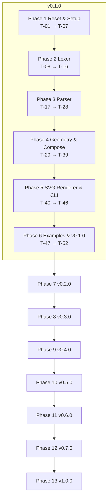

# Floras Bloom DSL — Implementation Tasks

| 項目 | 値 |
|------|-----|
| Status | Draft / **Approved (Ready to Implement)** / In Progress / Done |
| Author | yuuto |
| Last Updated | 2026-05-07 |
| Approved On | 2026-05-07 |
| Requirements | ./requirements.md (Approved) |
| Design | ./design.md (Approved) |

> 各タスク完了時にチェック。受け入れ基準ID（AC-XX-X）または FR-XX で要件と対応付ける。
> 1 タスク = 1〜3 時間粒度。これより大きいなら分割する。

## Release Strategy
| Version | スコープ | 含まれる Phase | 狙い |
|---------|---------|----------------|------|
| **v0.1.0** | 単一 bloom → SVG | Phase 1〜5 | 「動くデザイナー DSL」最小完動品 |
| **v0.2.0** | + palette トークン | Phase 6 | ブランド色管理 |
| **v0.3.0** | + bouquet (手動配置) | Phase 7 | キャンバス上の構成 |
| **v0.4.0** | + scatter (procedural 配置) | Phase 8 | 手描き感の量産 |
| **v0.5.0** | + motif (再利用パターン) | Phase 9 | 複合要素の再利用 |
| **v0.6.0** | + preview サーバ + ライブリロード | Phase 10 | 編集体験 |
| **v0.7.0** | + tokens.css 書き出し | Phase 11 | フロントエンドとの統合 |
| **v1.0.0** | + Web プレイグラウンド | Phase 12 | 公開・拡散の起爆剤 |

## Phase 1: Reset & Setup (合計 ~3h)
- [ ] **T-01**: 旧 v0.1.0 コードを削除（`floras/*.py` `tests/test_*.py` `examples/*.floras`）。CHANGELOG.md に「Pivot to designer DSL」エントリ追加 (0.5h) → ADR-08
- [ ] **T-02**: 旧 tests を `tests/_legacy/` へ退避（pytest collection 対象外）。新 spec が落ち着いたら削除 (0.3h)
- [ ] **T-03**: README.md を新方針で書き直す（「花テーマのデザイナー DSL」キャッチ + 簡単な使い方） (0.7h)
- [ ] **T-04**: pyproject.toml の `description` / `keywords` 更新、`floras.cli:main` エントリーポイントは維持 (0.3h)
- [ ] **T-05**: errors.py に新エラー型 `FlorasValidationError` `FlorasCLIError` 追加 (0.3h)
- [ ] **T-06**: `floras/__init__.py` を新方針に書き直す（`render(source) -> str` を export） (0.5h)
- [ ] **T-07**: `.github/workflows/test.yml` のジョブ確認（変更なしで OK のはず）、CI が pass することを確認 (0.4h)

## Phase 2: Lexer (合計 ~5h)
- [ ] **T-08**: `tokens.py` に新 TokenKind 全種類定義（数値 suffix / hex / oklch / range / 全キーワード） (1h) → FR-01, ADR-05
- [ ] **T-09**: `lexer.py` 雛形（`_Lexer` クラス、line/col トラッキング、コメント `shion ...` 流用） (0.5h)
- [ ] **T-10**: 数値リテラル + suffix の lex（`12` `12px` `12.5%` `90deg` `0.25turn` を 1 トークン） (1h) → ADR-05
- [ ] **T-11**: Hex 色リテラルの lex（`#RRGGBB` `#RRGGBBAA` 3/4 桁形式） (0.7h) → D-06
- [ ] **T-12**: 範囲演算子 `..` の lex（`12..32` を `NUMBER DOTDOT NUMBER`） (0.3h) → D-05
- [ ] **T-13**: 文字列リテラル `"..."` の lex（旧 `bara_kuchi` 廃止、シンプルな escape `\"` `\\`） (0.5h) → D-02
- [ ] **T-14**: キーワード認識（KEYWORDS 辞書） + 識別子（ハイフン許可） (0.5h) → FR-01
- [ ] **T-15**: Lexer ユニットテスト全 TokenKind 網羅、line/col 検証 (1.2h)
- [ ] **T-16**: Lexer エラーテスト（未知文字、未閉文字列、不正 hex） (0.3h)

## Phase 3: Parser (合計 ~5h)
- [ ] **T-17**: `ast_nodes.py` 全ノード定義（Program / PaletteDecl / BloomDecl / MotifDecl / BouquetDecl / Placement / ScatterDecl / Value 各種） (1h) → FR-02
- [ ] **T-18**: `parser.py` 雛形（再帰下降、`peek/consume/expect` ヘルパー） (0.5h)
- [ ] **T-19**: top-level decl のディスパッチ（palette / bloom / motif / bouquet / export） (0.5h)
- [ ] **T-20**: `palette_decl` パース（kebab/dotted token 対応、color_value 各種受理） (0.7h) → AC-03-1
- [ ] **T-21**: `bloom_decl` パース（プロパティ順不同辞書、`stroke <color> width <num>` の特殊形） (0.8h) → AC-02-*
- [ ] **T-22**: `bouquet_decl` パース（canvas / background / placement / scatter） (0.7h) → AC-04-*
- [ ] **T-23**: `placement` 解析（`at coord` / `size` / `rotation` / `color` の順不同オプション） (0.5h) → AC-04-1, AC-04-3
- [ ] **T-24**: `scatter_decl` パース（source / count / area / size / rotation / color / seed） (0.5h) → AC-05-*
- [ ] **T-25**: `motif_decl` パース（placement の繰り返し） (0.3h) → AC-06-*
- [ ] **T-26**: `area_spec` パース（canvas / ring / rect / grid） (0.5h) → AC-05-3, AC-05-4
- [ ] **T-27**: `color_value` パース（hex / oklch / palette ref + tinted） (0.5h) → D-06
- [ ] **T-28**: Parser ユニットテスト最小サンプル網羅、エラーケース 5 種以上 (1.2h)

## Phase 4: Geometry & Compose (合計 ~6h)
### 4a. Geometry (~2.5h)
- [ ] **T-29**: `geometry/petal.py` 実装（cubic bezier の対称花弁 path 生成） (1.2h) → AC-01-1, AC-02-1
- [ ] **T-30**: `geometry/stamen.py` 実装（N 個 circle のリング配置） (0.5h) → AC-02-1
- [ ] **T-31**: `geometry/leaf.py` 実装（楕円 path） (0.4h) → AC-02-4
- [ ] **T-32**: `geometry/stem.py` 実装（直線 line） (0.2h) → AC-02-4
- [ ] **T-33**: Geometry スナップショットテスト（path 文字列を fixture と比較） (0.7h) → G2

### 4b. Compose (~3.5h)
- [ ] **T-34**: `compose/scene.py` SceneGraph dataclass 定義（frozen） (0.3h) → ADR-06
- [ ] **T-35**: `compose/resolver.py` palette ref 解決（hex / oklch / tinted blend） (1h) → AC-03-1, AC-03-2, ADR-07
- [ ] **T-36**: oklch ↔ sRGB 変換（標準ライブラリのみ、~30 行） (0.7h) → ADR-07
- [ ] **T-37**: `compose/scatter.py` Scatter 展開（area=canvas/ring/rect/grid、seed 固定 PRNG） (1.2h) → AC-05-1, AC-05-3, AC-05-4
- [ ] **T-38**: `compose/__init__.py` トップレベル `compose(program, entry)` 実装（順序制御 + validation） (0.5h) → AC-02-2, AC-02-3, AC-04-2
- [ ] **T-39**: 循環 motif 検出（DFS で訪問済セット） (0.3h) → AC-06-3

## Phase 5: SVG Renderer & CLI (合計 ~4h)
- [ ] **T-40**: `render/svg.py` BloomInstance → SVG `<g>` 文字列（座標 2 桁丸め、arrange ring） (1.2h) → FR-06, AC-01-1
- [ ] **T-41**: arrange spiral サポート（黄金角 137.5deg） (0.4h) → AC-02-1
- [ ] **T-42**: `render/svg.py` Scene → 完全な `<svg>` 文字列（viewBox / background / items） (0.7h) → FR-06
- [ ] **T-43**: `cli.py` `floras render <file> --out <path> [--ast] [--entry <name>]` 実装 (0.7h) → AC-01-1, FR-04, FR-05, FR-11
- [ ] **T-44**: `cli.py` エラー整形（FlorasError → stderr 1 行、exit code 1/2） (0.4h) → AC-01-3, AC-01-4
- [ ] **T-45**: SVG renderer スナップショットテスト（5 種の典型 bloom） (0.4h) → AC-01-2
- [ ] **T-46**: examples/sakura.bloom + sakura-fixture.svg 作成 (0.2h) → AC-01-1

## Phase 6: Examples, Tests, v0.1.0 Release (合計 ~3h)
- [ ] **T-47**: `examples/sakura.bloom` `bara.bloom` `kiku.bloom` `cosmos.bloom` `yuri.bloom` の 5 種を作成 (1h)
- [ ] **T-48**: E2E テスト: 5 種を `floras render` で生成し snapshot SVG と diff (0.7h) → AC-01-2
- [ ] **T-49**: 決定論性テスト（同じ `.bloom` を 100 回 render → ハッシュ全件一致） (0.3h) → FR-08
- [ ] **T-50**: パフォーマンス計測（単一 bloom < 50ms） (0.3h) → NFR
- [ ] **T-51**: README.md に 5 種の Sample コード + 出力 SVG プレビュー（GitHub の auto-render を活用） (0.5h) → G3
- [ ] **T-52**: v0.1.0 タグ付け + GitHub リポジトリ公開（topics: `dsl`, `svg`, `design-tools`, `floral`） (0.2h)

## Phase 7: Palette (G3 / v0.2.0) (合計 ~2.5h)
- [ ] **T-53**: palette decl + ref の Parser はすでに Phase 3 で実装済。検証テスト追加 (0.5h) → AC-03-1
- [ ] **T-54**: tinted blend の正確性テスト（oklch 空間、参照値と比較） (0.7h) → ADR-07
- [ ] **T-55**: 重複 palette / 未定義トークンのエラーケース 5 種 (0.5h) → AC-03-2, AC-03-3
- [ ] **T-56**: examples/brand-mark.bloom 追加（palette + bloom 連携） (0.3h)
- [ ] **T-57**: README に palette セクション追加 (0.3h)
- [ ] **T-58**: v0.2.0 タグ + リリースノート (0.2h)

## Phase 8: Bouquet (G4 / v0.3.0) (合計 ~3h)
- [ ] **T-59**: SVG renderer に Bouquet 対応（複数 BloomInstance を canvas 上に並べる） (0.7h) → AC-04-1
- [ ] **T-60**: `place ... at center` ショートカットの解決 (0.3h) → AC-04-3
- [ ] **T-61**: background の SVG 出力（`<rect width=W height=H fill=...>`） (0.3h) → AC-04-4
- [ ] **T-62**: `--entry` オプション（複数 bouquet 含むファイルから 1 つ選択） (0.5h) → FR-05
- [ ] **T-63**: examples/bouquet-simple.bloom 追加（2 つの bloom） (0.3h) → AC-04-1
- [ ] **T-64**: AC-04-* の検証テスト (0.5h)
- [ ] **T-65**: v0.3.0 タグ + リリースノート (0.4h)

## Phase 9: Scatter (G5 / v0.4.0) (合計 ~3h)
- [ ] **T-66**: scatter 展開はすでに Phase 4 で実装済。area=ring/rect/grid のテスト整備 (1h) → AC-05-3, AC-05-4
- [ ] **T-67**: rotation `random` の決定論性テスト（同じ seed → 同じ結果） (0.3h) → AC-05-1
- [ ] **T-68**: `seed` 必須エラーのテスト (0.2h) → AC-05-2, FR-09
- [ ] **T-69**: examples/hero-petals.bloom 追加（60 個 scatter のヒーロー） (0.5h)
- [ ] **T-70**: スループット計測（100 個 scatter < 200ms） (0.3h) → NFR
- [ ] **T-71**: README に scatter セクション + Before/After GIF (0.5h)
- [ ] **T-72**: v0.4.0 タグ + リリースノート (0.2h)

## Phase 10: Motif (G6 / v0.5.0) (合計 ~3h)
- [ ] **T-73**: SVG renderer に MotifInstance 対応（`<g transform=translate(...)>` で子要素をグループ化） (0.7h) → AC-06-1
- [ ] **T-74**: scatter source が motif の場合の展開（各位置で MotifInstance 複製） (0.5h) → AC-06-2
- [ ] **T-75**: 循環 motif 参照の検出はすでに Phase 4 で実装済。テスト整備 (0.3h) → AC-06-3
- [ ] **T-76**: examples/spring-branch.bloom 追加（桜+葉+茎の motif） (0.5h)
- [ ] **T-77**: examples/woven-pattern.bloom 追加（motif を grid scatter） (0.4h)
- [ ] **T-78**: README に motif セクション + AB 比較 (0.4h)
- [ ] **T-79**: v0.5.0 タグ + リリースノート (0.2h)

## Phase 11: Preview Server (G7 / v0.6.0) (合計 ~5h)
- [ ] **T-80**: `preview.py` HTTP サーバ雛形（標準 `http.server.ThreadingHTTPServer` ベース） (0.7h) → FR-12
- [ ] **T-81**: ディレクトリ走査 → 全 `.bloom` を render → ギャラリー HTML 生成 (1h) → AC-07-1
- [ ] **T-82**: ファイル変更検出（fsevents/inotify を試み、失敗時 1 秒 polling フォールバック） (1h) → ADR-09
- [ ] **T-83**: SSE エンドポイント `/events`、ファイル変更で event push (0.7h) → AC-07-2
- [ ] **T-84**: ブラウザ側 EventSource → SVG 差し替え JS（vanilla、 ~30 行） (0.5h) → AC-07-2
- [ ] **T-85**: 文法エラー時の赤枠表示（render 失敗を catch して error placeholder 化） (0.5h) → AC-07-4
- [ ] **T-86**: ポート競合フォールバック（7878 → 7879 → ... → 7888） (0.3h) → AC-07-3
- [ ] **T-87**: preview の Integration テスト（urllib で SSE 接続 + ファイル変更） (0.5h)
- [ ] **T-88**: v0.6.0 タグ + リリースノート（デモ動画は MAY） (0.3h)

## Phase 12: Tokens Export (G8 / v0.7.0) (合計 ~2.5h)
- [ ] **T-89**: `render/css.py` palette → CSS Custom Properties (0.5h) → AC-08-1
- [ ] **T-90**: Tailwind v4 形式 (`@theme { --color-... }`) (0.5h) → AC-08-2
- [ ] **T-91**: JSON 形式（ネストオブジェクト） (0.3h) → AC-08-3
- [ ] **T-92**: `cli.py` `floras tokens <file> --out <path> --format <fmt>` 実装 (0.5h) → FR-13
- [ ] **T-93**: 3 形式の snapshot test (0.4h)
- [ ] **T-94**: README に tokens export 例 + Tailwind 統合手順 (0.3h)
- [ ] **T-95**: v0.7.0 タグ + リリースノート (0.2h)

## Phase 13: Web Playground (G9 / v1.0.0) (合計 ~12h)
### 13a. Pyodide 互換 (~2h)
- [ ] **T-96**: pyproject.toml を Pyodide 互換に整備（pure Python であることを CI で検証） (0.3h)
- [ ] **T-97**: GitHub Actions で wheel 生成 + Release 添付 (0.7h)
- [ ] **T-98**: `floras.render(source: str) -> str` ブラウザ用 API として整備 (0.5h)
- [ ] **T-99**: Pyodide で wheel をインストール → render を呼ぶ smoke test (0.5h)

### 13b. SPA 実装 (~8h)
- [ ] **T-100**: `playground/` Vite + TS + pnpm 初期化 (0.5h)
- [ ] **T-101**: Monaco Editor 統合（`.bloom` 用シンプルハイライト） (1.5h)
- [ ] **T-102**: Pyodide ローダ（初回ロード進捗 UI） (1h)
- [ ] **T-103**: 「Render」ボタン → Pyodide 経由で `floras.render` → SVG プレビュー (1h) → AC-09-2
- [ ] **T-104**: stderr/エラー表示（赤字、行番号） (0.5h)
- [ ] **T-105**: 「Sample」ドロップダウン（5 種以上の `.bloom` プリセット） (0.5h)
- [ ] **T-106**: 「Tokens」ボタン → palette を CSS で表示 (0.7h)
- [ ] **T-107**: 「Share」ボタン → URL ハッシュエンコード/デコード + クリップボードコピー (1h) → AC-09-3, AC-09-4
- [ ] **T-108**: アクセシビリティ（キーボードのみ操作可、aria-label） (0.5h)
- [ ] **T-109**: スケルトンスクリーン + ロード中インジケータ (0.3h)
- [ ] **T-110**: Lighthouse 測定 + LCP < 3s 達成までチューニング (0.5h) → AC-09-1

### 13c. 公開 (~2h)
- [ ] **T-111**: Cloudflare Pages デプロイ設定 (`wrangler.toml`, `_headers` for SAB) (0.7h) → ADR-10
- [ ] **T-112**: ドメイン設定（`floras.dev` または `bloom.floras.dev`） (0.3h)
- [ ] **T-113**: Playwright E2E（Render / Tokens / Share シナリオ） (0.7h) → AC-09-2, AC-09-3
- [ ] **T-114**: README に Playground URL を Top に + デモ GIF (0.3h)
- [ ] **T-115**: v1.0.0 タグ + リリースノート + Hacker News / Reddit 投稿準備 (0.5h)

**合計見積（最終）**:
- Core (Phase 1-6): **~25h** （v0.1.0 リリース基準）
- 拡張 v0.2-v0.7 (Phase 7-12): **~19h**
- Playground v1.0 (Phase 13): **~12h**
- **総計: 約 56h**（土日趣味ペースで 2〜3 ヶ月、専業 1.5 週間）

## Dependencies

> Phase 4 (Geometry) と Phase 4b (Compose) は依存しないので**並列開発可**（互いの interface を最初に固める）。

## Milestones
- **M1 (T-16 完了)**: Lexer が全 TokenKind を認識できる
- **M2 (T-28 完了)**: 任意の有効 `.bloom` が AST に変換できる
- **M3 (T-39 完了)**: AST が SceneGraph に compose できる
- **M4 (T-46 完了)**: 単一 bloom が SVG として書き出せる ← v0.1.0 リリース基準
- **M5 (T-52 完了)**: GitHub に公開できる作品レベル
- **M6 (T-79 完了)**: motif が動く（design 機能の山場が完了）
- **M7 (T-95 完了)**: 全 7 機能が CLI で揃う
- **M8 (T-115 完了)**: 世界中の誰でもブラウザで Floras Bloom を試せる ← v1.0.0 ゴール

## Definition of Done

### v0.1.0 (Core)
- [ ] AC-01-* / AC-02-* 全通過
- [ ] `examples/sakura.bloom` の出力 SVG が snapshot fixture と完全一致
- [ ] `pytest --cov=floras` でカバレッジ 85% 以上
- [ ] `mypy --strict` エラー 0 件
- [ ] `ruff check .` 警告 0 件
- [ ] CI が macOS / Ubuntu × Python 3.11 / 3.12 でグリーン
- [ ] README に 5 種の `.bloom` サンプル + 出力 SVG プレビュー
- [ ] LICENSE / CHANGELOG.md 更新

### v0.2.0 〜 v0.7.0 (各拡張)
- [ ] 該当する拡張 AC（AC-03-* 〜 AC-08-*）通過
- [ ] 拡張モジュール単体カバレッジ 85% 以上
- [ ] README に該当機能セクション追加
- [ ] CHANGELOG.md に該当バージョンのリリースノート

### v1.0.0 (Playground + 全機能統合)
- [ ] AC-09-* 全通過（Render / Tokens / Share / Sample）
- [ ] Lighthouse Performance 90+ / Accessibility 90+
- [ ] Playwright E2E 2 シナリオがグリーン
- [ ] Pyodide ロード後の総バンドル < 6MB gz
- [ ] Cloudflare Pages にデプロイ済み + カスタムドメイン疎通
- [ ] README Top に Playground URL + デモ GIF
- [ ] **MonoFloras 公式サイトで Floras Bloom 製アセット 3 点以上を本番採用**（G10）
- [ ] **G11 達成**: GitHub Star 50+ を 3 ヶ月以内（達成は時間ゲート、リリース時点でゼロでも v1.0.0 タグはリリース可）

## Risks Encountered（実装中に判明した想定外の事項）
- _実装開始後に追記_

## Out of Scope（本 spec に含めない、別 spec で扱う）
- PNG / JPG 直接出力（NG1）
- Lottie / SMIL アニメーション（NG2）
- 制御構文（if/while/for）— 必要なら別 spec `bloom-logic`
- ベクター編集 GUI（NG4）
- ラスター画像インポート / トレース（NG6）
- 3D / WebGL（NG7）
- Floras Bloom から外部 HTTP fetch（NG8）
- VS Code 拡張 / LSP — 別 spec `bloom-editor-support`
- Playground のユーザーアカウント / 共有コード DB 永続化 — 別 spec `playground-backend`
- Figma プラグイン（双方向同期）— 別 spec `figma-bridge`
