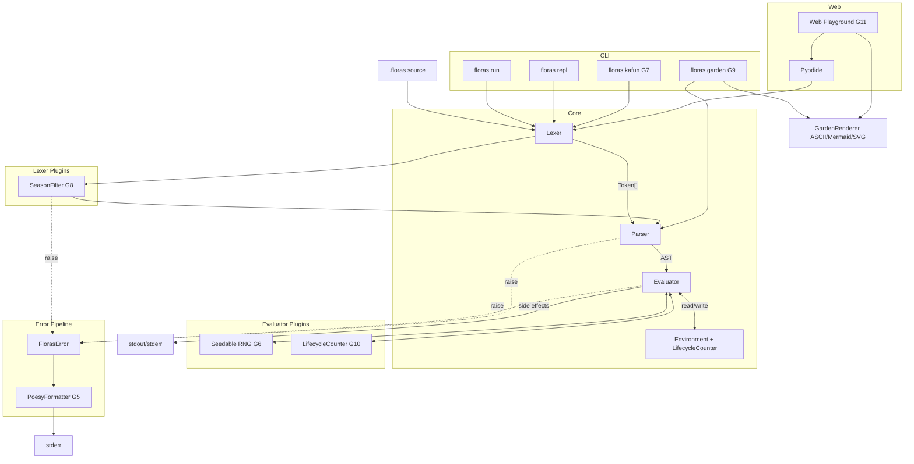
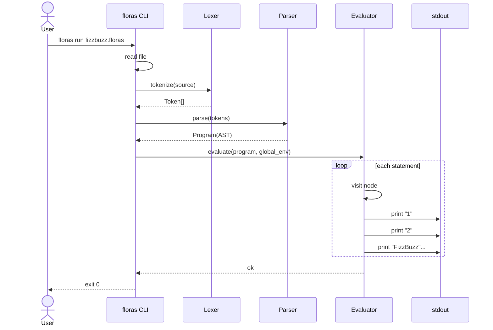
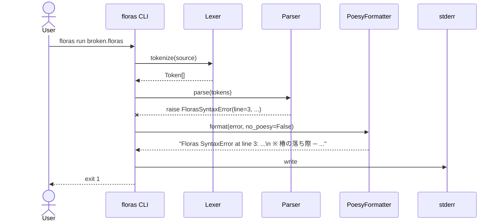
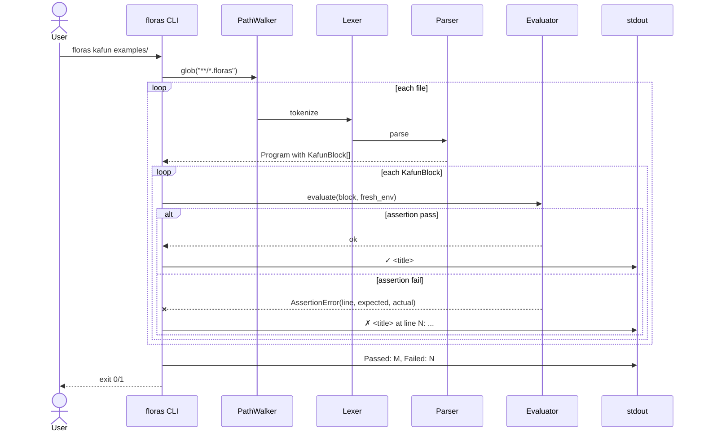
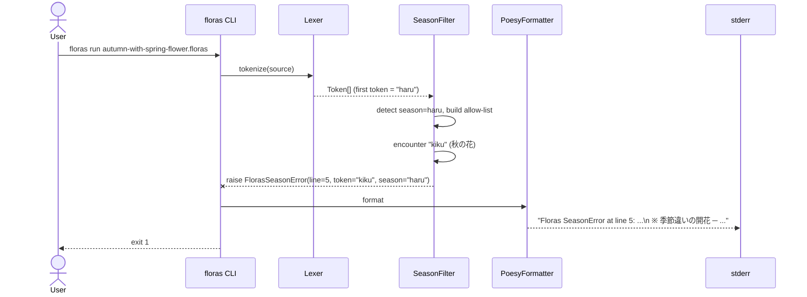
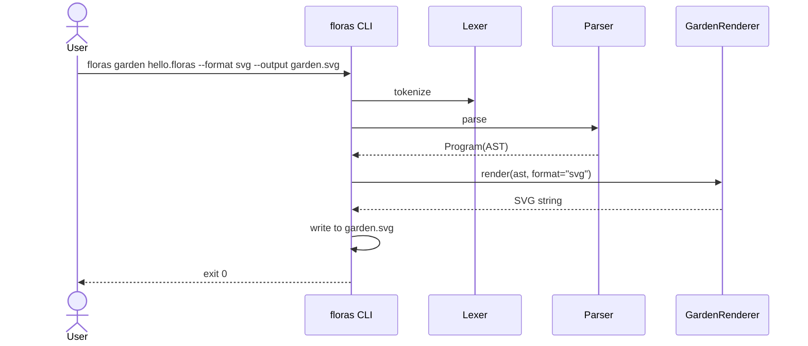
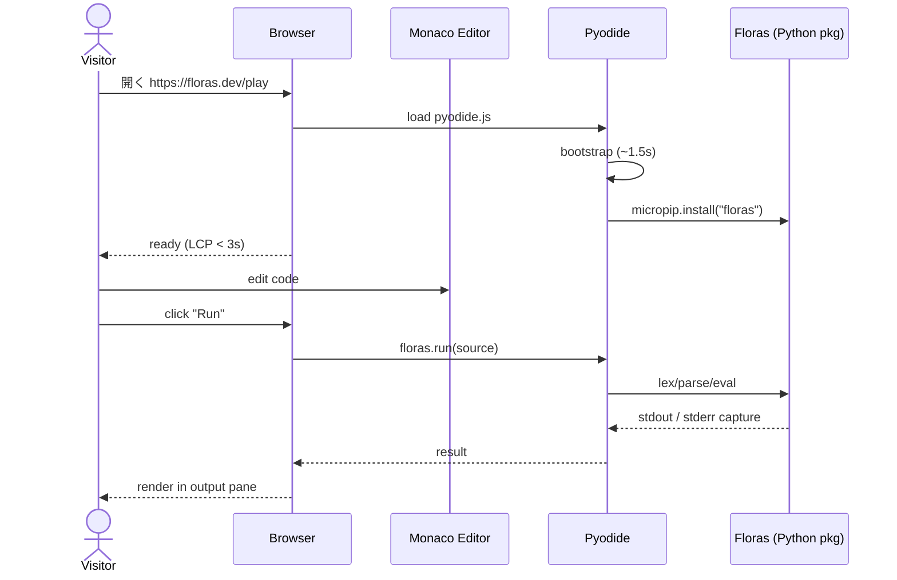
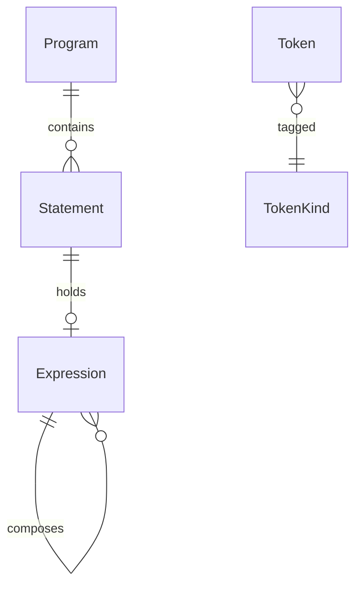

# Floras Language Core — Design

| 項目 | 値 |
|------|-----|
| Status | Draft / In Review / **Approved** |
| Author | yuuto |
| Last Updated | 2026-05-03 |
| Approved On | 2026-05-03 |
| Requirements | ./requirements.md |

## Architecture Overview
**Tree-walking Interpreter** を中核に、7 機能を**プラグ可能な周辺サブシステム**として接続する。コアは依然として Lexer → Parser → Evaluator の一方向パイプライン。各サブシステムは「コア API のフック」または「ポストプロセッサ」として実装され、コアを汚染しない。



設計原則:
- **Core は不変**: Lexer/Parser/Evaluator は本 spec の Core 仕様 (FR-01〜FR-10) のみ責務とする。
- **プラグイン疎結合**: SeasonFilter は Lexer の出力に挿入される単純な filter、Lifecycle は Env の decorator、Poesy は Error の formatter。各機能は独立に有効/無効化可能。
- **CLI は ファサード**: 4 つのサブコマンド（run/repl/kafun/garden）は内部 API を組み合わせるだけ。
- **Web は Pyodide で再利用**: バックエンド不要。Floras パッケージをそのままブラウザで動かす。

## Sequence: スクリプト実行（Happy Path / AC-01-1, AC-04-2）


## Sequence: 構文エラー + 花言葉（Error Path / AC-01-3 + AC-07-1）


## Sequence: kafun テスト実行（US-09 / FR-14）


## Sequence: 季節モード違反（US-10 / FR-17）


## Sequence: floras garden（US-11 / FR-18）


## Sequence: Web Playground Run（US-13 / FR-20）


## Data Model

### Token
```python
# floras/tokens.py
from dataclasses import dataclass
from enum import Enum

class TokenKind(str, Enum):
    # Literals
    NUMBER = "NUMBER"
    STRING = "STRING"
    IDENT  = "IDENT"
    # Keywords
    SAKURA = "sakura"; YURI = "yuri"; BARA = "bara"; TSUBAKI = "tsubaki"
    UME = "ume"; RAN = "ran"; HIMAWARI = "himawari"
    HASU = "hasu"; ASAGAO = "asagao"; TANPOPO = "tanpopo"
    BOTAN = "botan"; AYAME = "ayame"
    # Brackets
    KOBUSHI = "kobushi"; MOKUREN = "mokuren"        # ( )
    AJISAI  = "ajisai";  KIKYOU  = "kikyou"         # { }
    KOSUMOSU = "kosumosu"; DAHLIA = "dahlia"        # [ ]
    # Punctuation
    NADESHIKO = "nadeshiko"  # ;
    KASUMI    = "kasumi"     # ,
    # Assignment / Comparison / Arithmetic / Logical
    TSUYUKUSA = "tsuyukusa"          # =
    WASURENAGUSA = "wasurenagusa"    # ==
    AZAMI = "azami"                  # !=
    FUKUJUSOU = "fukujusou"          # <
    TACHIAOI = "tachiaoi"            # >
    SUIREN = "suiren"                # <=
    SHOBU = "shobu"                  # >=
    MOMO = "momo"; KEITOU = "keitou"; MARIGOLD = "marigold"
    SUZURAN = "suzuran"; RENGE = "renge"
    SUMIRE = "sumire"; PANSY = "pansy"; KESHI = "keshi"
    # String literal pair (D-02)
    BARA_KUCHI = "bara_kuchi"       # " (open)
    BARA_TOJIRU = "bara_tojiru"     # " (close)
    # Extended (v0.2.0+)
    KAKITSUBATA = "kakitsubata"     # 花占い演算子 (G6)
    KAFUN = "kafun"                 # テストブロック (G7)
    KARERU = "kareru"               # ライフタイム明示解放 (G10)
    # 二十四節気宣言 (D-07, v0.5.0)
    RISSHUN = "risshun"; USUI = "usui"; KEICHITSU = "keichitsu"; SHUNBUN = "shunbun"
    SEIMEI = "seimei"; KOKUU = "kokuu"; RIKKA = "rikka"; SHOUMAN = "shouman"
    BOUSHU = "boushu"; GESHI = "geshi"; SHOUSHO = "shousho"; TAISHO = "taisho"
    RISSHUU = "risshuu"; SHOSHO = "shosho"; HAKURO = "hakuro"; SHUUBUN = "shuubun"
    KANRO = "kanro"; SOUKOU = "soukou"; RITTOU = "rittou"; SHOUSETSU = "shousetsu"
    TAISETSU = "taisetsu"; TOUJI = "touji"; SHOUKAN = "shoukan"; DAIKAN = "daikan"
    TOSHI = "toshi"
    # 装飾花トークン (節気 allow-list 用、v0.5.0 で追加予約)
    FUJI = "fuji"; HANASHOUBU = "hanashoubu"; HAGI = "hagi"; HIGANBANA = "higanbana"
    SAZANKA = "sazanka"; SUISEN = "suisen"; ROBAI = "robai"
    # Meta
    EOF = "EOF"

@dataclass(frozen=True)
class Token:
    kind: TokenKind
    lexeme: str          # 元ソースの文字列
    line: int            # 1-origin
    col: int             # 1-origin
    value: object = None # 数値・文字列の場合の Python 値
```

### AST Node
```python
# floras/ast_nodes.py — 抜粋
from dataclasses import dataclass

class Node: ...

# Statements
@dataclass
class LetStmt(Node):       # sakura name tsuyukusa <expr> nadeshiko
    name: str
    value: "Expr"
    line: int

@dataclass
class FnDecl(Node):        # yuri name kobushi params mokuren ajisai body kikyou
    name: str
    params: list[str]
    body: list[Node]
    line: int

@dataclass
class IfStmt(Node):        # bara kobushi cond mokuren ajisai then kikyou (tsubaki ajisai else kikyou)?
    cond: "Expr"
    then_branch: list[Node]
    else_branch: list[Node] | None
    line: int

@dataclass
class WhileStmt(Node):
    cond: "Expr"
    body: list[Node]
    line: int

@dataclass
class ReturnStmt(Node):
    value: "Expr | None"
    line: int

@dataclass
class ExprStmt(Node):
    expr: "Expr"
    line: int

# Expressions
class Expr(Node): ...

@dataclass
class NumberLit(Expr):  value: float; line: int
@dataclass
class StringLit(Expr):  value: str;   line: int
@dataclass
class BoolLit(Expr):    value: bool;  line: int
@dataclass
class NullLit(Expr):    line: int
@dataclass
class Identifier(Expr): name: str;    line: int
@dataclass
class Assign(Expr):     name: str; value: Expr; line: int
@dataclass
class Binary(Expr):     op: TokenKind; left: Expr; right: Expr; line: int
@dataclass
class Unary(Expr):      op: TokenKind; operand: Expr; line: int
@dataclass
class Call(Expr):       callee: str; args: list[Expr]; line: int

# Extended (v0.2.0+)
@dataclass
class Kakitsubata(Expr):                   # G6: 二項演算ではなく、左右結合する N-項の選択式
    choices: list[Expr]
    line: int

@dataclass
class KafunBlock(Node):                    # G7: kafun "title" ajisai ... kikyou
    title: str
    body: list[Node]
    line: int

@dataclass
class KareruStmt(Node):                    # G10: kareru name nadeshiko
    name: str
    line: int

@dataclass
class SeasonDecl(Node):                    # G8: haru/natsu/aki/fuyu/toshi nadeshiko
    season: str  # "haru" | "natsu" | "aki" | "fuyu" | "toshi"
    line: int

@dataclass
class Program(Node):
    statements: list[Node]
    season: str = "toshi"   # デフォルトは年中（制約なし）
```

### ER 図（概念）


## Grammar (EBNF) — D-05 で**全演算子優先順位廃止・括弧必須**
```ebnf
program     ::= seasonDecl? statement* EOF
seasonDecl  ::= SEASON_TOKEN "nadeshiko"
SEASON_TOKEN ::= "risshun" | "usui" | ... | "daikan" | "toshi"   (* 25 種 *)

statement   ::= letStmt | fnDecl | ifStmt | whileStmt | returnStmt
              | kafunBlock | kareruStmt | exprStmt

letStmt     ::= "sakura" IDENT "tsuyukusa" expression "nadeshiko"
fnDecl      ::= "yuri" IDENT "kobushi" params? "mokuren" block
ifStmt      ::= "bara" "kobushi" expression "mokuren" block ("tsubaki" (ifStmt | block))?
whileStmt   ::= "ume"  "kobushi" expression "mokuren" block
returnStmt  ::= "ran" expression? "nadeshiko"
kafunBlock  ::= "kafun" STRING block               (* G7: テストブロック *)
kareruStmt  ::= "kareru" IDENT "nadeshiko"          (* G10: 明示解放 *)
exprStmt    ::= expression "nadeshiko"

block       ::= "ajisai" statement* "kikyou"
params      ::= IDENT ("kasumi" IDENT)*

(* === 式: 優先順位なし、必ず括弧で明示 === *)
expression  ::= assignExpr
assignExpr  ::= IDENT "tsuyukusa" expression       (* 唯一の右結合 *)
              | binaryExpr
binaryExpr  ::= unary (BINOP unary)*               (* 左結合、全 binop 同順 *)
BINOP       ::= "momo" | "keitou" | "marigold" | "suzuran" | "renge"
              | "wasurenagusa" | "azami" | "fukujusou" | "tachiaoi"
              | "suiren" | "shobu"
              | "sumire" | "pansy" | "kakitsubata"
unary       ::= ("keshi" | "keitou") unary | call
call        ::= primary ("kobushi" args? "mokuren")*
args        ::= expression ("kasumi" expression)*
primary     ::= NUMBER | NUMERIC_FLOWER | STRING
              | "hasu" | "asagao" | "tanpopo"
              | IDENT
              | "kobushi" expression "mokuren"     (* グルーピングは必須 *)

NUMBER          ::= 数字表記 (-?[0-9]+ ("." [0-9]+)?)
NUMERIC_FLOWER  ::= "ichirin" | "nirin" | ... | "ichimanrin" | "mukarin"  (* 整数値、Lexer で int に変換 *)
STRING          ::= "bara_kuchi" <任意文字列> "bara_tojiru"
```

### 優先順位ルール（D-05）
- **二項演算子は全て同順位、左結合**。`a momo b marigold c` は `(a momo b) marigold c` ではなく **SyntaxError**。
- 複数の二項演算子を 1 式で使うには `kobushi ... mokuren` で必ずグルーピング。
- 例: `kobushi 2 momo 3 mokuren marigold 4` → 14、`kobushi 2 momo kobushi 3 marigold 4 mokuren mokuren` → 14
- 例外的に `binaryExpr` 内で**同じ演算子が連続**する場合は括弧不要（左結合の自然な拡張）。例: `1 momo 2 momo 3` は OK（`((1+2)+3)`）
- 例外的に `binaryExpr` 内で**異なる演算子が混在**する場合は SyntaxError。例: `1 momo 2 marigold 3` はエラー、`kobushi 1 momo 2 mokuren marigold 3` と書く。
- `kakitsubata` も他演算子と同列。`a kakitsubata b kakitsubata c` は OK（同一演算子連続）。`a kakitsubata b momo c` はエラー。

### 設計意図（ADR-13 参照）
- **学習価値**: 評価順を視覚的に明示するため、隠れた優先順位の罠が消える。
- **実装簡素**: precedence climbing 不要、Pratt parser 不要、純粋な再帰下降で済む。
- **トレードオフ**: コード冗長化。`kobushi 1 momo 2 mokuren marigold kobushi 3 momo 4 mokuren` のように深く括弧が必要。Floras の世界観上はむしろ「花のつながり」として読める。

## Error Types
```python
# floras/errors.py
class FlorasError(Exception):
    def __init__(self, line: int, message: str):
        super().__init__(f"Floras {self.kind} at line {line}: {message}")
        self.line = line

class FlorasSyntaxError(FlorasError):   kind = "SyntaxError"
class FlorasNameError(FlorasError):     kind = "NameError"
class FlorasTypeError(FlorasError):     kind = "TypeError"
class FlorasArityError(FlorasError):    kind = "ArityError"
class FlorasRuntimeError(FlorasError):  kind = "RuntimeError"
class FlorasInternalError(FlorasError): kind = "InternalError"
# Extended (v0.2.0+)
class FlorasLifetimeError(FlorasError): kind = "LifetimeError"   # G10
class FlorasSeasonError(FlorasError):   kind = "SeasonError"     # G8
class FlorasAssertionError(FlorasError):kind = "AssertionError"  # G7 kafun 内
class FlorasCLIError(FlorasError):      kind = "CLIError"        # G9 invalid --format 等
```

> 全エラーは `PoesyFormatter` を通って `--no-poesy` でない限り花言葉行が付与される（FR-11）。

## CLI Contract
| サブコマンド | 引数 / オプション | 動作 | 関連 AC |
|-------------|------------------|------|---------|
| `floras run <file>` | path, `--no-poesy`, `--ast` | 実行 → exit 0/1/2 | AC-01-*, AC-07-2, FR-08 |
| `floras repl` | `--no-poesy` | 対話モード起動 | AC-06-* |
| `floras kafun <path>` | path（ファイル or ディレクトリ）, `--no-poesy` | テスト実行 → exit 0/1 | AC-09-* |
| `floras garden <file>` | path, `--format ascii\|mermaid\|svg`, `--output <out>` | AST 可視化 | AC-11-* |
| `floras --version` | - | バージョン文字列 | - |
| `floras --help` | - | 使い方 | - |

### 環境変数
| 変数 | 用途 | デフォルト |
|------|------|-----------|
| `FLORAS_SEED` | `kakitsubata` の RNG seed（決定論化） | 未設定 = 真の乱数 |
| `FLORAS_LIFESPAN` | 変数の世代カウンタ上限（自動枯死） | 0 = 無効 |
| `FLORAS_DEBUG` | Lexer/Parser の中間状態を stderr | 未設定 |

### エラー出力フォーマット
```
Floras SyntaxError at line 3: expected nadeshiko (;) but got kikyou (})
  ※ 椿の落ち際 ─ ここに想定外の音が混ざりました

Floras NameError at line 7: 'mystery' is not defined
  ※ 勿忘草の願い ─ この名前は記憶されていません

Floras LifetimeError at line 12: 'tmp' has withered (lifespan=10 exceeded)
  ※ 萎みゆく花弁 ─ この変数はもう枯れています
```

## Component Designs (Extended Features)

### G5. PoesyFormatter
```python
# floras/poesy.py
POESY: dict[str, str] = {
    "SyntaxError":   "椿の落ち際 ─ ここに想定外の音が混ざりました",
    "NameError":     "勿忘草の願い ─ この名前は記憶されていません",
    # ... (Glossary の Poesy Map 参照)
}

def format_error(err: FlorasError, *, no_poesy: bool = False) -> str:
    head = str(err)  # "Floras XError at line N: ..."
    if no_poesy: return head
    saying = POESY.get(err.kind, "野に咲く名もなき花")
    return f"{head}\n  ※ {saying}"
```
- `errors.py` と疎結合。CLI 層が捕捉時に呼ぶだけ。

### G6. Seedable RNG (kakitsubata)
```python
# floras/rng.py
import os, random
def get_rng() -> random.Random:
    seed = os.environ.get("FLORAS_SEED")
    return random.Random(int(seed)) if seed is not None else random.Random()
```
- Evaluator は singleton として 1 つの `Random` を保持。
- `Kakitsubata(choices)` を評価する際、`rng.choice(choices)` で 1 つだけ評価する（短絡）。

### G7. KafunRunner
```python
# floras/kafun.py
@dataclass
class KafunResult:
    title: str
    file: Path
    line: int
    passed: bool
    message: str = ""

def run_kafun_blocks(paths: list[Path]) -> list[KafunResult]:
    # 1. 各 .floras ファイルを Lex / Parse
    # 2. Program 内の KafunBlock のみを抽出
    # 3. それぞれ fresh Environment で評価
    # 4. ブロック末尾の式の真偽値で PASS/FAIL 判定
    #    （例: "fib kobushi 10 mokuren wasurenagusa 55" → 真なら PASS）
```
- `floras run` は Program を評価する際 `KafunBlock` を**スキップ**する（FR-15）。
- `floras kafun` は `KafunBlock` だけを評価し、それ以外の文も依存として実行する（関数定義など）。

### G8. SeasonFilter (D-07: 二十四節気)
```python
# floras/season.py
# 25 区分: 24 節気 + toshi（年中=制約なし）
SEKKI_ADDITIONAL: dict[str, frozenset[TokenKind]] = {
    "risshun":   frozenset({TokenKind.TSUBAKI, TokenKind.UME}),
    "usui":      frozenset({TokenKind.UME, TokenKind.SUZURAN}),
    "keichitsu": frozenset({TokenKind.MOKUREN, TokenKind.KOBUSHI}),
    "shunbun":   frozenset({TokenKind.SAKURA, TokenKind.SUMIRE}),
    "seimei":    frozenset({TokenKind.SAKURA, TokenKind.MARIGOLD}),
    "kokuu":     frozenset({TokenKind.BOTAN, TokenKind.FUJI}),
    "rikka":     frozenset({TokenKind.YURI, TokenKind.AJISAI}),
    "shouman":   frozenset({TokenKind.HASU, TokenKind.ASAGAO}),
    "boushu":    frozenset({TokenKind.AJISAI, TokenKind.HANASHOUBU}),
    "geshi":     frozenset({TokenKind.HASU, TokenKind.HIMAWARI}),
    "shousho":   frozenset({TokenKind.HIMAWARI, TokenKind.KESHI}),
    "taisho":    frozenset({TokenKind.HIMAWARI, TokenKind.ASAGAO}),
    "risshuu":   frozenset({TokenKind.KIKYOU, TokenKind.HAGI}),
    "shosho":    frozenset({TokenKind.SHION, TokenKind.HAGI}),
    "hakuro":    frozenset({TokenKind.KOSUMOSU, TokenKind.KASUMI}),
    "shuubun":   frozenset({TokenKind.HIGANBANA, TokenKind.KIKU}),
    "kanro":     frozenset({TokenKind.KIKU, TokenKind.KOSUMOSU}),
    "soukou":    frozenset({TokenKind.KIKU, TokenKind.DAHLIA}),
    "rittou":    frozenset({TokenKind.TSUBAKI, TokenKind.SAZANKA}),
    "shousetsu": frozenset({TokenKind.SAZANKA, TokenKind.SUISEN}),
    "taisetsu":  frozenset({TokenKind.SUISEN, TokenKind.FUKUJUSOU}),
    "touji":     frozenset({TokenKind.SUISEN, TokenKind.SHOBU}),
    "shoukan":   frozenset({TokenKind.FUKUJUSOU, TokenKind.ROBAI}),
    "daikan":    frozenset({TokenKind.ROBAI, TokenKind.TSUBAKI}),
    "toshi":     frozenset(),  # 空 = 全許可（特殊扱い）
}

# 装飾花トークン: 通常識別子のように扱われるが、季節モードでは allow-list に含まれない限り SeasonError
DECORATIVE_FLOWERS: frozenset[TokenKind] = frozenset({
    TokenKind.SAKURA, TokenKind.UME, TokenKind.TSUBAKI, TokenKind.KOBUSHI,
    TokenKind.MOKUREN, TokenKind.SUMIRE, TokenKind.SUZURAN,
    TokenKind.AJISAI, TokenKind.YURI, TokenKind.HASU, TokenKind.ASAGAO,
    TokenKind.HIMAWARI, TokenKind.KIKU, TokenKind.KOSUMOSU, TokenKind.KIKYOU,
    TokenKind.SHION, TokenKind.DAHLIA, TokenKind.MARIGOLD, TokenKind.KESHI,
    TokenKind.BOTAN,  # 注: botan は ALWAYS_ALLOWED 側に入れる予定（print 機能のため）
    TokenKind.FUJI, TokenKind.HANASHOUBU, TokenKind.HAGI, TokenKind.HIGANBANA,
    TokenKind.SAZANKA, TokenKind.SUISEN, TokenKind.ROBAI,
})

ALWAYS_ALLOWED: frozenset[TokenKind] = frozenset({
    # 制御キーワード
    TokenKind.SAKURA, TokenKind.YURI, TokenKind.BARA, TokenKind.TSUBAKI,
    TokenKind.UME, TokenKind.RAN, TokenKind.SHION, TokenKind.HIMAWARI,
    TokenKind.KAKITSUBATA, TokenKind.KAFUN, TokenKind.KARERU,
    TokenKind.BOTAN, TokenKind.AYAME, TokenKind.HASU, TokenKind.ASAGAO,
    TokenKind.TANPOPO,
    # 全記号トークン
    TokenKind.KOBUSHI, TokenKind.MOKUREN, TokenKind.AJISAI, TokenKind.KIKYOU,
    TokenKind.KOSUMOSU, TokenKind.DAHLIA,
    TokenKind.NADESHIKO, TokenKind.KASUMI, TokenKind.TSUYUKUSA,
    TokenKind.WASURENAGUSA, TokenKind.AZAMI, TokenKind.FUKUJUSOU,
    TokenKind.TACHIAOI, TokenKind.SUIREN, TokenKind.SHOBU,
    TokenKind.MOMO, TokenKind.KEITOU, TokenKind.MARIGOLD, TokenKind.SUZURAN,
    TokenKind.RENGE, TokenKind.SUMIRE, TokenKind.PANSY, TokenKind.KESHI,
    # 文字列ペア
    TokenKind.BARA_KUCHI, TokenKind.BARA_TOJIRU,
    # メタ
    TokenKind.NUMBER, TokenKind.STRING, TokenKind.IDENT, TokenKind.EOF,
    # 25 季節宣言トークン
    TokenKind.RISSHUN, TokenKind.USUI, TokenKind.KEICHITSU, TokenKind.SHUNBUN,
    TokenKind.SEIMEI, TokenKind.KOKUU, TokenKind.RIKKA, TokenKind.SHOUMAN,
    TokenKind.BOUSHU, TokenKind.GESHI, TokenKind.SHOUSHO, TokenKind.TAISHO,
    TokenKind.RISSHUU, TokenKind.SHOSHO, TokenKind.HAKURO, TokenKind.SHUUBUN,
    TokenKind.KANRO, TokenKind.SOUKOU, TokenKind.RITTOU, TokenKind.SHOUSETSU,
    TokenKind.TAISETSU, TokenKind.TOUJI, TokenKind.SHOUKAN, TokenKind.DAIKAN,
    TokenKind.TOSHI,
})

def filter_tokens(tokens: list[Token]) -> list[Token]:
    # 1. 先頭が SeasonDecl なら sekki を抽出（無宣言なら toshi）
    # 2. sekki=toshi なら全許可（filter なしで通過）
    # 3. それ以外: 各 token について以下を判定
    #    - ALWAYS_ALLOWED に含まれる → OK
    #    - DECORATIVE_FLOWERS に含まれず ALWAYS_ALLOWED にもない → 通常識別子として OK
    #    - DECORATIVE_FLOWERS に含まれ、かつ SEKKI_ADDITIONAL[sekki] に含まれる → OK
    #    - DECORATIVE_FLOWERS に含まれるが SEKKI_ADDITIONAL[sekki] には含まれない → FlorasSeasonError
```
- Lexer の出力を Parser に渡す前に挿入される pure な filter。
- AC-10-5 の「制御キーワードと記号は常に使える」を `ALWAYS_ALLOWED` で表現。
- 25 節気 × 約 2 装飾花 = テスト想定 50 ケース + 違反ケース 50 ケース。

### Sample Code: hello.floras（D-02 + D-05 反映）
```floras
shion 全構文要素が花名で構成された Floras
sakura name tsuyukusa bara_kuchi world bara_tojiru nadeshiko
yuri greet kobushi n mokuren ajisai
  botan kobushi kobushi bara_kuchi Hello,  bara_tojiru momo n mokuren mokuren nadeshiko
kikyou
greet kobushi name mokuren nadeshiko
```

### Sample Code: fizzbuzz.floras（D-02 + D-05 反映）
```floras
sakura i tsuyukusa 1 nadeshiko
ume kobushi i suiren 15 mokuren ajisai
  bara kobushi kobushi i renge 15 mokuren wasurenagusa 0 mokuren ajisai
    botan kobushi bara_kuchi FizzBuzz bara_tojiru mokuren nadeshiko
  kikyou tsubaki bara kobushi kobushi i renge 3 mokuren wasurenagusa 0 mokuren ajisai
    botan kobushi bara_kuchi Fizz bara_tojiru mokuren nadeshiko
  kikyou tsubaki bara kobushi kobushi i renge 5 mokuren wasurenagusa 0 mokuren ajisai
    botan kobushi bara_kuchi Buzz bara_tojiru mokuren nadeshiko
  kikyou tsubaki ajisai
    botan kobushi i mokuren nadeshiko
  kikyou
  i tsuyukusa kobushi i momo 1 mokuren nadeshiko
kikyou
```

> 比較演算子と算術演算子の混在には括弧が必要。`i renge 15 wasurenagusa 0` は単一式に見えるが、`renge` と `wasurenagusa` は別演算子なので `kobushi i renge 15 mokuren wasurenagusa 0` と書く。

### G9. GardenRenderer
```python
# floras/garden.py
def render_ascii(node: Node, indent: int = 0) -> str: ...
def render_mermaid(program: Program) -> str: ...
def render_svg(program: Program) -> str: ...

NODE_FLOWERS: dict[type, str] = {
    LetStmt: "🌸", FnDecl: "🌼", IfStmt: "🌹", WhileStmt: "🌷",
    Call: "🌺", Binary: "🪻", NumberLit: "🌻", StringLit: "🪷",
    BoolLit: "💮", Identifier: "🍀",
}
```
- ASCII: ツリー描画 + 花絵文字。
- Mermaid: `graph TD` ノードに花絵文字 + ラベル。
- SVG: 各ノードを「茎 + 花」として横配置。viewBox は AST 深さ × 幅で算出。

### G10. LifecycleCounter
```python
# floras/lifecycle.py
@dataclass
class Cell:
    value: object
    born_at: int   # 生成時のグローバルステップ番号
    last_touched_at: int
    withered: bool = False

class LifecycleEnv(Environment):
    def __init__(self, lifespan: int):
        self.lifespan = lifespan      # 0 = 無効
        self.step = 0                 # 評価ステップカウンタ
    def get(self, name: str) -> object:
        cell = self._cells[name]
        if cell.withered: raise FlorasLifetimeError(...)
        if self.lifespan > 0 and self.step - cell.last_touched_at > self.lifespan:
            cell.withered = True
            raise FlorasLifetimeError(...)
        cell.last_touched_at = self.step
        return cell.value
    def wither(self, name: str) -> None:
        # kareru キーワード処理
```
- 既存 `Environment` を継承。`lifespan=0` なら従来動作。
- `step` は Evaluator の各文評価ごとに +1 される。

### G11. Web Playground
```
playground/
├── index.html
├── src/
│   ├── editor.ts        # Monaco Editor のラップ
│   ├── runner.ts        # Pyodide 経由で floras を呼ぶ
│   ├── garden.ts        # SVG をブラウザに埋める
│   └── share.ts         # URL ハッシュエンコード/デコード
├── public/
│   └── floras-<ver>-py3-none-any.whl   # CI でアーカイブ
├── vite.config.ts
└── package.json
```
- ホスティング: Cloudflare Pages（無料、SPA 配信）→ Open Question Q9。
- ビルド: Vite。Pyodide は CDN から動的ロード。
- 言語パッケージ: GitHub Release の wheel を CI で playground/public に配置。
- ナビゲーションなし、シンプル 1 ページ。

## Alternatives Considered
| 案 | Pros | Cons | 採否 |
|----|------|------|------|
| **A. Tree-walking interpreter (Python)** | 実装最短、可読性高、学習価値大 | 性能は劣る | ✅ 採用 |
| B. Bytecode VM (Python) | 高速、構造的 | 学習コスト高、v0.1.0 には過剰 | ❌（v0.3.0 で再検討） |
| C. ANTLR / PLY 利用 | 文法定義がきれい | 「自分で作る」価値が薄れる | ❌ |
| D. Rust で実装 | 性能・型安全 | 言語処理系×Rust の二重学習負荷 | ❌（別プロジェクトで） |

## Decisions (ADR形式)

### ADR-01: 全構文要素を花の名前にする
- **Status**: Accepted (2026-05-03)
- **Context**: 単なるキーワードのみ花名化では他言語との差別化が弱い。括弧・演算子も含めて全て花にすることで唯一無二の作品性を獲得できる。
- **Decision**: キーワード・括弧・演算子・区切り記号の**すべて**を花名トークンとする。例外は数値リテラル・文字列リテラル・ユーザー識別子のみ。
- **Consequences**:
  - (+) 強い世界観、SNS・ポートフォリオでの話題性
  - (+) Lexer 実装が「キーワードテーブル引き」で済み、シンプル
  - (-) 1 行が長くなる（FizzBuzz が約 25 トークン → 約 60 トークン）
  - (-) 暗記必要な語彙が増える → README の対照表で軽減

### ADR-02: ホスト言語を Python に固定
- **Status**: Accepted (2026-05-03)
- **Context**: 学習リソース最大化と実装速度を優先したい。
- **Decision**: Python 3.11+ で実装し、外部依存はゼロに保つ。
- **Consequences**:
  - (+) 実行環境の準備が容易
  - (+) `dataclass`, `match` 文で AST 表現が綺麗
  - (-) 性能は妥協（学習目的のため許容）

### ADR-03: Tree-walking interpreter を採用
- **Status**: Accepted (2026-05-03)
- **Context**: バイトコード VM はスコープ外。
- **Decision**: AST を直接訪問する Visitor パターンで評価する。
- **Consequences**:
  - (+) 実装最短、デバッグ容易
  - (-) 速度は遅い（fib(20) は数秒許容）

### ADR-04: トークンとして長い名前を許容
- **Status**: Accepted (2026-05-03)
- **Context**: `wasurenagusa`（==）など 12 文字キーワードがある。
- **Decision**: 識別子規則 `[a-zA-Z_][a-zA-Z0-9_]*` で全て吸収し、Lexer はキーワードテーブルで分類する。
- **Consequences**:
  - (+) 規則統一でシンプル
  - (-) ユーザーが `wasurenagusa` を変数名にしようとしてもエラーになる（FR-10 通り意図的）

### ADR-05: 拡張機能は「Core 不変・プラグイン追加」アーキで段階リリース
- **Status**: Accepted (2026-05-03)
- **Context**: 7 機能を一気に v0.1.0 に詰め込むと品質保証が困難。一方で機能ごとに別リポジトリは過剰。
- **Decision**: モノレポ内で各機能を独立モジュール（`floras/poesy.py`, `season.py`, `kafun.py`, `garden.py`, `lifecycle.py`, `rng.py`）として実装し、Core (lexer/parser/evaluator) は変更しない。バージョンは v0.1〜v1.0 で段階リリース。
- **Consequences**:
  - (+) 各機能が独立にテスト可能、バグ局所化
  - (+) 学習者は Core を v0.1.0 で読み終えられる
  - (-) 拡張機能と Core の境界設計に追加工数

### ADR-06: 季節モードは Lexer 後の filter として実装
- **Status**: Accepted (2026-05-03)
- **Context**: 季節制約をどこで検査するか — Lexer 内、Parser 内、別パスのいずれか。
- **Decision**: Lexer の出力 Token[] を受け取り Token[] を返す**純粋関数フィルタ**として実装。Parser からは見えない。
- **Consequences**:
  - (+) Core を一切変更せずに導入可能
  - (+) `--no-season` フラグで簡単にバイパスできる
  - (-) Token 列を 2 回走査するため微小なオーバヘッド（実用上無視可能）

### ADR-07: `kakitsubata` は左結合 N-項の選択演算子
- **Status**: Accepted (2026-05-03)
- **Context**: `a kakitsubata b kakitsubata c` の解釈 — 「(a or b) or c」二段、「a/b/c の 3 択」N-項のどちらか。
- **Decision**: パース時に左結合で N-項配列に畳み込み、評価時に 1 度だけ `random.choice(choices)` を呼ぶ（一様分布）。
- **Consequences**:
  - (+) 3 択以上の確率がフラットになる（直感に合う）
  - (+) AC-08-1 の「100 回中 ≥10 回」が成立しやすい
  - (-) 二段の 1/4 / 1/4 / 1/2 のような偏り表現が直接書けない（後続バージョンで `kakitsubata_weighted` 検討）

### ADR-08: `kafun` ブロックは `floras run` ではスキップ
- **Status**: Accepted (2026-05-03)
- **Context**: 同一ファイルにテストと本実装が共存する場合の挙動。
- **Decision**: `floras run` は `KafunBlock` を構文解析するが評価しない。`floras kafun` は逆に `KafunBlock` だけを評価し、それ以外の文（関数定義など）は依存として実行する。
- **Consequences**:
  - (+) Doctest 的に「コード = ドキュメント = テスト」を 1 ファイルに収められる
  - (+) `floras run` の挙動が変わらない（既存スクリプトの後方互換）
  - (-) 学習者にとって 2 つの実行モードを覚える必要

### ADR-09: GardenRenderer は AST のみに依存する純粋関数
- **Status**: Accepted (2026-05-03)
- **Context**: 評価結果も含めるか、構文木だけを描くか。
- **Decision**: AST のみを入力とする。評価情報（実行値・分岐選択結果）は描かない。
- **Consequences**:
  - (+) Evaluator 不要 → 高速・実装単純
  - (+) Web Playground でも同じ関数を再利用可能
  - (-) 「実行時に実際にどの枝が選ばれたか」を可視化したい将来要望には対応できない（v1.5.0 で `--trace` モード検討）

### ADR-10: Web Playground は静的サイト + Pyodide で完結
- **Status**: Accepted (2026-05-03)
- **Context**: バックエンドサーバー（Floras 実行環境を Python で持つ API）にする選択肢もある。
- **Decision**: Pyodide で Floras Python パッケージを丸ごとブラウザに持ち込む。バックエンドゼロ。
- **Consequences**:
  - (+) インフラコスト ¥0（Cloudflare Pages 無料枠）
  - (+) ユーザーコードが外部に出ないためプライバシー優位
  - (-) 初回ロードが Pyodide 分（~10MB）重い → LCP < 3s 目標は努力目標
  - (-) Floras 側を Pyodide 互換に保つ制約（純 Python であれば問題なし）

### ADR-11: 文字列リテラルは花名ペア `bara_kuchi ... bara_tojiru` で囲む（D-02）
- **Status**: Accepted (2026-05-03)
- **Context**: 「全構文要素を花名にする」原則を徹底するため、文字列引用符 `"` も花名トークン化する必要がある。
- **Decision**: `bara_kuchi`（薔薇口）でオープン、`bara_tojiru`（薔薇閉じる）でクローズ。間の文字列は任意 Unicode テキスト。
- **Consequences**:
  - (+) 全構文花名化原則が完全に成立
  - (+) Lexer はキーワード `bara_kuchi` を見つけたら次の `bara_tojiru` までを STRING として読むだけ（実装簡単）
  - (-) コードが長くなる: `"hello"` → `bara_kuchi hello bara_tojiru`（4 トークン → 16 文字）
  - (-) 文字列内に `bara_tojiru` を含めたい場合のエスケープ規則が必要（v1.0.0 では未対応、含む文字列はパースエラー）

### ADR-12: 数値リテラルは数字表記と花数詞を併用（D-03）
- **Status**: Accepted (2026-05-03)
- **Context**: 数字 0-9 を完全に花名化すると実用性が破綻するが、世界観強化のため花数詞も使えるようにしたい。
- **Decision**: 標準は数字表記 `25`。並行して `nijuugorin` のような花数詞も同じ値として解釈される（Lexer で int に変換）。
- **Consequences**:
  - (+) 「実用パフォーマンス」と「世界観強化」両立
  - (+) 詩的なコードを書きたい人は花数詞、実務では数字
  - (-) Lexer に花数詞テーブル（規則生成 or 明示テーブル）が必要 → v0.5.0 で実装
  - (-) 同じ値の 2 表記が許され、コードレビューで一貫性が問題になる可能性 → コーディング規約で「1 ファイル内では統一」を推奨

### ADR-13: 演算子優先順位を全廃し、括弧明示を強制（D-05）
- **Status**: Accepted (2026-05-03)
- **Context**: C 系優先順位は実装コストと教材複雑度を上げる。Floras は学習用かつ作品性優先。
- **Decision**: 二項演算子は全て同順位の左結合。複数異種演算子の混在は必ず `kobushi ... mokuren` で明示。
- **Consequences**:
  - (+) Parser 実装が劇的に単純（precedence climbing 不要、Pratt 不要）
  - (+) 評価順が視覚的に明確 → 学習者にやさしい
  - (+) 「同じ演算子の連続だけは許容」のため `1 momo 2 momo 3` は自然
  - (-) コード冗長化（`kobushi 1 momo kobushi 2 marigold 3 mokuren mokuren`）
  - (-) 既存言語経験者には窮屈、ただし Floras の世界観では「花を一輪ずつ束ねる」と再解釈可能

### ADR-14: 季節モードは二十四節気 25 区分で実装（D-07）
- **Status**: Accepted (2026-05-03)
- **Context**: 大区分 4 つ（haru/natsu/aki/fuyu）+ toshi では区別が粗く、文化的深みも乏しい。一方 24 節気は実装負荷が増す。
- **Decision**: 旧 4 区分案を廃し、二十四節気 24 トークン + `toshi` の 25 区分を採用。各節気の追加許可リストは独自表で 2 トークンずつ厳選（D-11）。
- **Consequences**:
  - (+) 唯一無二の差別化機能、SNS で話題化しやすい
  - (+) 文化価値・教養価値が高い（季節を考えるコード）
  - (+) ALWAYS_ALLOWED + 節気ごとの追加許可という二層構造で実装は管理可能
  - (-) Token 種別が 25 増、テストファイル数も 25 必要
  - (-) ユーザーが節気を覚える学習コスト → README の表 + Playground の「節気ピッカー」UI で軽減
  - (-) 装飾花トークン 7 個（fuji/hanashoubu/hagi/higanbana/sazanka/suisen/robai）の追加予約も必要

## Cross-cutting Concerns
- **ロギング**: Floras 自体のロギングは無し。デバッグ用に `FLORAS_DEBUG=1` 環境変数があれば Lexer/Parser の中間状態を stderr に出す（v0.1.0 では実装任意）。
- **エラーハンドリング**: 全エラーは `FlorasError` 階層に統一。CLI 層で捕捉して整形して stderr に出力。
- **認証**: 不要（CLI ツール）
- **キャッシュ**: 不要
- **i18n**: エラーメッセージは英語固定（v0.1.0）
- **監視**: 不要

## Risks
| Risk | Impact | Likelihood | Mitigation |
|------|--------|-----------|-----------|
| 花名と Python 予約語の衝突 | 中 | 低 | 全花トークン名を事前に Python 予約語リストと突合（CIで検証） |
| 演算子優先順位のバグ | 高 | 中 | 優先順位ごとに専用パーステスト（factor/term/comparison/logic/choice） |
| 再帰関数のスタックオーバーフロー | 中 | 中 | Python の `sys.setrecursionlimit(2000)` を CLI 起動時に設定 |
| ユーザーが識別子に花名を使い混乱 | 低 | 高 | エラーメッセージで「花名は予約語」と明示、類似トークン suggest |
| 似た花名（`shobu` / `ayame` 等）の混乱 | 中 | 中 | README の対照表で強調、エラー時に類似トークンを suggest |
| `kakitsubata` の RNG が CI 実行ごとに不安定 | 高 | 高 | テストでは `FLORAS_SEED=0` を強制設定 |
| `kafun` テスト数が増えて遅い | 中 | 中 | 並列実行（`concurrent.futures`）を v1.0.0 で導入 |
| 季節 allow-list 設計が議論を呼ぶ | 低 | 高 | Open Question Q11 として歳時記準拠 vs 独自表を明示し、ユーザーカスタム可能にする (`.floras-season.toml`) |
| `kareru` 自動枯死がデバッグを困難にする | 中 | 中 | デフォルト無効 (`FLORAS_LIFESPAN=0`)、明示的に opt-in |
| Pyodide の SharedArrayBuffer 要件で Cloudflare Pages にヘッダ追加が必要 | 中 | 中 | `_headers` ファイルで `Cross-Origin-Opener-Policy: same-origin` 等を設定 |
| Pyodide 初回ロード重さで離脱率高 | 高 | 中 | スケルトンスクリーン + 「Pyodide ロード中」プログレス + サンプルプリロード |
| 花言葉の品質が薄っぺらく見える | 中 | 中 | Open Question Q6 で詩のトーンを統一（俳句/現代詩/英語訳のいずれか） |

## Test Strategy
- **Unit (Lexer)**: 全 TokenKind について「正しい入力 → 期待トークン列」のテーブルテスト
- **Unit (Parser)**: 各文法規則ごとに最小サンプルで AST 構造を検証
- **Unit (Evaluator)**: 算術・比較・スコープ・関数呼び出し・再帰・truthy 判定
- **Unit (Poesy)**: 全エラー型に対し花言葉行が付与される / `--no-poesy` で省略される
- **Unit (Season)**: 各季節の allow-list が正しい / 違反トークンで `SeasonError` / `ALWAYS_ALLOWED` は常に通る
- **Unit (Kafun)**: PASS / FAIL / 混在の集計 / `floras run` でスキップされる
- **Unit (Garden)**: ASCII / Mermaid / SVG 各形式のスナップショットテスト
- **Unit (Lifecycle)**: lifespan 超過で `LifetimeError` / `kareru` で即解放 / `lifespan=0` で無効
- **Unit (RNG)**: `FLORAS_SEED` 設定で同一出力 / 未設定で分布
- **Integration**: `examples/*.floras` を `floras run` で実行し、固定の期待出力と比較
- **Integration (kafun)**: `examples/*.floras` 内の `kafun` ブロックを `floras kafun` で全実行
- **E2E (Playground)**: Playwright で「ページ表示 → コード入力 → Run → 出力確認」「Garden 表示」「Share URL コピー」の 3 シナリオ
- **Property-based** (v1.0.0+): `hypothesis` で random expression を生成し「lex → parse → unparse → lex 結果が一致」
- **Error tests**: 全エラー型 (8 種) について「最小再現コード → 期待エラー文字列 + 期待花言葉」を検証
- **Coverage**: `pytest --cov=floras --cov-report=term-missing`、85% 以上を CI ゲート（Web Playground 部分は別計測）
