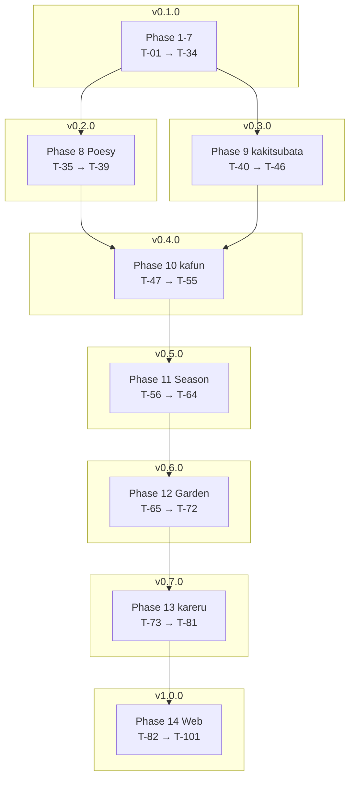

# Floras Language Core — Implementation Tasks

> ⚠️ **Status: SUPERSEDED (2026-05-07)** — Phase 1〜7 (v0.1.0) は完遂済 (`4755d9f`)。
> Phase 8〜14 は破棄、新 spec [.claude/specs/bloom-dsl/](../bloom-dsl/) に切替。

| 項目 | 値 |
|------|-----|
| Status | Draft / Approved / In Progress / Done / **Superseded** |
| Author | yuuto |
| Last Updated | 2026-05-03 |
| Approved On | 2026-05-03 |
| Requirements | ./requirements.md (Approved) |
| Design | ./design.md (Approved) |

> 各タスク完了時にチェック。受け入れ基準ID（AC-XX-X）または FR-XX で要件と対応付ける。
> 1 タスク = 1〜3 時間粒度。これより大きいなら分割する。

## Release Strategy
| Version | スコープ | 含まれる Phase | 狙い |
|---------|---------|----------------|------|
| **v0.1.0** | Core 言語 (FizzBuzz が動く) | Phase 1〜7 | 言語処理系の最小完動品 |
| **v0.2.0** | + 花言葉エラー (G5) | Phase 8 | 世界観強化、低工数で大インパクト |
| **v0.3.0** | + `kakitsubata` 花占い演算子 (G6) | Phase 9 | 遊び心の追加 |
| **v0.4.0** | + `kafun` テスト DSL (G7) | Phase 10 | 言語内蔵テスト |
| **v0.5.0** | + 季節モード (G8) | Phase 11 | 最大の差別化機能 |
| **v0.6.0** | + `floras garden` AST 可視化 (G9) | Phase 12 | ポートフォリオ映え |
| **v0.7.0** | + `kareru` ライフタイム (G10) | Phase 13 | 教育価値追加 |
| **v1.0.0** | + Web プレイグラウンド (G11) | Phase 14 | 公開・拡散の起爆剤 |

## Phase 1: Setup & Skeleton (合計 ~3h)
- [ ] **T-01**: リポジトリ初期化（`git init`, `pyproject.toml`, `README.md` 雛形, `.gitignore`） (0.5h)
- [ ] **T-02**: パッケージ骨格作成（`floras/` ディレクトリ + 空モジュール7個 + `__init__.py`） (0.5h)
- [ ] **T-03**: `pytest` + `mypy --strict` + `ruff` 設定、CI (`.github/workflows/test.yml`) を追加 (1h)
- [ ] **T-04**: `floras` CLI エントリーポイント雛形（`floras --version` のみ動く） (0.5h)
- [ ] **T-05**: `errors.py` に `FlorasError` 階層定義 + ユニットテスト (0.5h) → FR-09

## Phase 2: Lexer (合計 ~6h)
- [ ] **T-06**: `tokens.py` に全 `TokenKind` と `Token` dataclass 定義（**Core 用 + 文字列ペア `bara_kuchi/bara_tojiru`**） (0.7h) → FR-01, Glossary, ADR-11
- [ ] **T-07**: キーワード→TokenKind マップ（`KEYWORDS`）と Python 予約語衝突検査スクリプト (0.5h) → ADR-04
- [ ] **T-08**: `lexer.py` 実装（数値・識別子・キーワード・コメント `shion`） (1.5h) → FR-01
- [ ] **T-08b**: 文字列リテラル `bara_kuchi ... bara_tojiru` の lex（任意 Unicode をそのまま取り込み） (1h) → ADR-11, AC-09-1
- [ ] **T-09**: Lexer ユニットテスト（全 Core TokenKind を網羅、line/col 検証含む） (1.5h)
- [ ] **T-10**: Lexer エラーテスト（未知文字、未閉文字列＝`bara_tojiru` 不足） (0.5h) → FR-05

## Phase 3: Parser (合計 ~5h、D-05 で簡素化)
- [ ] **T-11**: `ast_nodes.py` 全ノード定義（Statement / Expression） (0.5h) → FR-02
- [ ] **T-12**: `parser.py` 雛形（再帰下降パーサ、`peek/consume/expect` ヘルパー） (1h)
- [ ] **T-13**: 式パース実装（D-05: 優先順位なし、`primary (BINOP primary)*` の単純規則 + 同一演算子連続のみ許容、異種混在で SyntaxError） (1h) → AC-02-1, ADR-13
- [ ] **T-14**: 文パース実装（let / fn / if / while / return / exprStmt） (1.5h) → AC-03-1, AC-04-1, AC-05-1
- [ ] **T-15**: Parser ユニットテスト（各文・各式の最小サンプル + 異種演算子混在エラーケース） (0.7h)
- [ ] **T-16**: Parser エラーテスト（不足括弧、未対応トークン、行番号付き） (0.3h) → AC-01-3

## Phase 4: Evaluator (合計 ~6h)
- [ ] **T-17**: `environment.py` 実装（スコープチェーン、define/get/assign） (1h) → US-05
- [ ] **T-18**: `evaluator.py` 雛形（Visitor パターン、`evaluate(node, env)`） (0.5h) → FR-03
- [ ] **T-19**: リテラル・変数参照・代入・二項・単項評価 (1.5h) → AC-02-1, AC-02-2
- [ ] **T-20**: if / while / return（`ReturnSignal` 例外で実装） (1h) → AC-03-1, AC-04-1
- [ ] **T-21**: 関数定義・呼び出し・再帰・arity チェック (1.5h) → AC-05-1, AC-05-2, AC-05-3
- [ ] **T-22**: 組み込み関数 `botan`(print) / `ayame`(input) (0.5h) → US-01

## Phase 5: CLI & REPL (合計 ~3h)
- [ ] **T-23**: `floras run <file>` 実装 + 終了コード制御 (1h) → AC-01-1, 01-2, 01-3, FR-04
- [ ] **T-24**: `--ast` フラグ（AST を JSON 出力） (0.5h) → FR-08
- [ ] **T-25**: `floras repl` 実装（`code.InteractiveConsole`、変数永続化） (1h) → AC-06-1, 06-2, 06-3, FR-07
- [ ] **T-26**: エラーメッセージ整形（CLI 層で `FlorasError` キャッチして 1 行で出力） (0.5h) → FR-05, FR-06

## Phase 6: Examples & QA (合計 ~3h)
- [ ] **T-27**: `examples/hello.floras` + `fizzbuzz.floras` + `fib.floras` 作成 (0.5h) → AC-01-1, AC-04-2, AC-05-3
- [ ] **T-28**: E2E テスト（examples を実行し期待出力 fixture と diff） (1h) → AC-04-2
- [ ] **T-29**: パフォーマンス計測（fizzbuzz < 200ms / fib(20) < 2s） (0.5h) → NFR
- [ ] **T-30**: README 作成（インストール・実行・全花名対照表・サンプル） (1h) → G3
- [ ] **T-31**: ライセンス追加（Open Question Q4 解決後、MIT 想定） (0.1h) → Q4

## Phase 7: Release v0.1.0 (合計 ~1h)
- [ ] **T-32**: バージョン v0.1.0 タグ付け (0.2h)
- [ ] **T-33**: GitHub リポジトリ公開 + Topics 設定（`programming-language`, `interpreter`, `python`, `flowers`） (0.5h)
- [ ] **T-34**: ポートフォリオサイトに掲載（任意） (-)

## Phase 8: 花言葉エラー (G5) → v0.2.0 (合計 ~3h)
- [ ] **T-35**: `floras/poesy.py` に `POESY` テーブルと `format_error()` 実装 (0.5h) → AC-07-1
- [ ] **T-36**: CLI 全コマンドに `--no-poesy` フラグ追加し、CLI 層で formatter を呼ぶように変更 (0.5h) → AC-07-2
- [ ] **T-37**: 全 8 エラー型に対する花言葉行付与テスト（snapshot test） (1h) → AC-07-3, FR-11
- [ ] **T-38**: README に花言葉サンプル（before/after 比較）を追加 (0.5h)
- [ ] **T-39**: v0.2.0 タグ付け + リリースノート (0.5h)

## Phase 9: kakitsubata 花占い演算子 (G6) → v0.3.0 (合計 ~3h)
- [ ] **T-40**: `tokens.py` に `KAKITSUBATA` 追加、`ast_nodes.py` に `Kakitsubata(choices)` 追加 (0.3h)
- [ ] **T-41**: Parser に `choice` 規則追加、左結合 N-項に畳む (0.7h) → ADR-07
- [ ] **T-42**: `floras/rng.py` 実装 + Evaluator から呼び出し（短絡評価） (0.5h) → FR-12, AC-08-3
- [ ] **T-43**: `FLORAS_SEED` 対応 + 決定論テスト (0.5h) → FR-13, AC-08-2
- [ ] **T-44**: 分布テスト（100 回試行で各候補が ≥10 回） (0.5h) → AC-08-1
- [ ] **T-45**: `examples/uranai.floras`（花占いサンプル）追加 (0.3h)
- [ ] **T-46**: v0.3.0 タグ付け + リリースノート (0.2h)

## Phase 10: kafun テスト DSL (G7) → v0.4.0 (合計 ~6h)
- [ ] **T-47**: `tokens.py` に `KAFUN` 追加、`ast_nodes.py` に `KafunBlock(title, body)` 追加 (0.3h)
- [ ] **T-48**: Parser に `kafunBlock` 規則追加（`kafun` STRING block） (0.5h)
- [ ] **T-49**: `Evaluator` で「`floras run` モード時は KafunBlock をスキップ」フラグ追加 (0.5h) → FR-15, AC-09-4
- [ ] **T-50**: `floras/kafun.py` に `KafunRunner` 実装（fresh env で各ブロック評価、PASS/FAIL 判定） (1.5h) → FR-14
- [ ] **T-51**: `floras kafun <path>` CLI サブコマンド + ディレクトリ走査 (1h) → AC-09-3
- [ ] **T-52**: PASS/FAIL/Summary レポート整形（カラー出力対応） (0.5h) → AC-09-1, AC-09-2
- [ ] **T-53**: kafun の AssertionError 専用テスト + Open Question Q8 確認（seed 自動設定） (1h)
- [ ] **T-54**: `examples/test-fib.floras`（kafun ブロック付きサンプル）追加 (0.3h)
- [ ] **T-55**: v0.4.0 タグ付け + リリースノート (0.4h)

## Phase 11: 季節モード (G8) → v0.5.0 (合計 ~10h、D-07 で 24 節気採用により拡張)
### 11a. 数値リテラル拡張（D-03）
- [ ] **T-55b**: `tokens.py` に `NUMERIC_FLOWER` 追加、Lexer に花数詞テーブル + 規則生成器（`ichirin`〜`senrin` + `mukarin`） (1.5h) → ADR-12, D-03
- [ ] **T-55c**: 花数詞のテスト（10 種以上の値で数字表記と等価判定） (0.5h)

### 11b. 二十四節気トークン定義
- [ ] **T-56**: `tokens.py` に 24 節気 + `TOSHI` の 25 トークン + 装飾花 7 トークン（fuji, hanashoubu, hagi, higanbana, sazanka, suisen, robai）追加 (0.5h) → ADR-14
- [ ] **T-56b**: `ast_nodes.py` に `SeasonDecl` 追加 (0.2h)
- [ ] **T-57**: Parser で先頭文の SeasonDecl 検出（複数宣言は SyntaxError、25 種すべて受理） (0.7h) → AC-10-4, AC-10-6

### 11c. SeasonFilter 実装（25 区分 × 装飾花 allow-list）
- [ ] **T-58**: `floras/season.py` に `SEKKI_ADDITIONAL`(25 個) + `DECORATIVE_FLOWERS` + `ALWAYS_ALLOWED` 定義 (1.5h) → ADR-06, ADR-14, AC-10-5
- [ ] **T-59**: `filter_tokens()` 実装（Lexer 出力のポストフィルタ、装飾花のみ制約適用） (1h) → FR-16
- [ ] **T-60**: `FlorasSeasonError` 追加 + 違反時の raise (0.3h) → FR-17, AC-10-2

### 11d. テスト・サンプル
- [ ] **T-61**: 全 25 節気 × 装飾花 allow / deny のテーブルテスト（≥ 100 ケース） (1.5h) → AC-10-1, AC-10-2, AC-10-3, AC-10-6
- [ ] **T-62**: 代表サンプル `examples/haiku-shunbun.floras`, `haiku-shuubun.floras`, `haiku-touji.floras` の 3 つ (0.7h)
- [ ] **T-63**: README に 25 節気 allow-list 表 + 「節気とは何か」入門セクション (1h)
- [ ] **T-64**: v0.5.0 タグ付け + リリースノート (0.3h)

## Phase 12: floras garden AST 可視化 (G9) → v0.6.0 (合計 ~7h)
- [ ] **T-65**: `floras/garden.py` 雛形 + `NODE_FLOWERS` マップ + `render_ascii()` (1.5h) → AC-11-1
- [ ] **T-66**: `render_mermaid()` 実装（`graph TD` 出力、ノード ID 自動採番） (1.5h) → AC-11-2
- [ ] **T-67**: `render_svg()` 実装（茎+花の SVG レイアウト、深さで縦伸び） (2h) → AC-11-3
- [ ] **T-68**: `floras garden <file> --format <fmt> --output <out>` CLI サブコマンド (0.7h) → FR-18
- [ ] **T-69**: 不正 `--format` の `CLIError` 処理 (0.3h) → AC-11-4
- [ ] **T-70**: 各形式のスナップショットテスト（fixture 比較） (0.7h)
- [ ] **T-71**: README に「Hello World の Garden」スクリーンショット掲載 (0.3h)
- [ ] **T-72**: v0.6.0 タグ付け + リリースノート (0.2h)

## Phase 13: kareru ライフタイム (G10) → v0.7.0 (合計 ~5h)
- [ ] **T-73**: `tokens.py` に `KARERU` 追加、`ast_nodes.py` に `KareruStmt(name)` 追加 (0.3h)
- [ ] **T-74**: Parser に `kareruStmt` 規則追加 (0.3h)
- [ ] **T-75**: `floras/lifecycle.py` に `Cell` + `LifecycleEnv` 実装（`step` カウンタ含む） (1.5h) → FR-19
- [ ] **T-76**: 既存 `Environment` を `LifecycleEnv` に差し替え可能にする（`lifespan=0` 時は素通し） (0.5h) → AC-12-3
- [ ] **T-77**: `FlorasLifetimeError` 追加 + `kareru` 評価で wither 実行 (0.5h) → AC-12-1, AC-12-4
- [ ] **T-78**: `FLORAS_LIFESPAN` 環境変数の読み取り (0.3h) → AC-12-2
- [ ] **T-79**: テスト一式（明示解放 / 自動枯死 / 無効化 / 未定義名 wither） (1h)
- [ ] **T-80**: README に「ライフタイム入門」セクション + Rust オーナーシップとの対比表 (0.5h)
- [ ] **T-81**: v0.7.0 タグ付け + リリースノート (0.1h)

## Phase 14: Web プレイグラウンド (G11) → v1.0.0 (合計 ~15h)
### 14a. 配布パッケージ準備 (~2h)
- [ ] **T-82**: `pyproject.toml` を Pyodide 互換に整備（pure Python 確認、`build-system`） (0.5h)
- [ ] **T-83**: GitHub Actions で wheel 生成 + Release 添付ワークフロー (1h)
- [ ] **T-84**: `floras` を `import floras; floras.run(source)` でブラウザから呼べる API として整備 (0.5h)

### 14b. SPA 実装 (~10h)
- [ ] **T-85**: `playground/` ディレクトリ作成 + Vite + TypeScript + pnpm 初期化 (0.5h)
- [ ] **T-86**: Monaco Editor 統合（Floras 用ハイライト最低限） (2h)
- [ ] **T-87**: Pyodide ローダ実装（`runner.ts`、初回ロード進捗 UI 含む） (1.5h)
- [ ] **T-88**: 「Run」ボタン → Pyodide で `floras.run()` 呼び出し → 出力ペイン更新 (1h) → AC-13-2, FR-20
- [ ] **T-89**: stderr 表示（赤字、花言葉行も含む） (0.5h) → AC-13-3
- [ ] **T-90**: 「Garden」ボタン → SVG 描画（`render_svg` を Pyodide 越しに呼ぶ） (1.5h) → AC-13-4
- [ ] **T-91**: 「Kafun」ボタン → `floras.kafun()` 実行 (1h)
- [ ] **T-92**: 「Share」ボタン → URL ハッシュエンコード + クリップボードコピー (1h) → AC-13-5
- [ ] **T-93**: アクセシビリティ対応（キーボードのみで全操作、aria-label） (1h) → NFR
- [ ] **T-94**: スケルトンスクリーン + Pyodide ロード中インジケータ (0.5h)
- [ ] **T-95**: サンプルプリセット 7 つ（各機能 1 つ）+ ドロップダウンで切替 (1h)

### 14c. 公開 (~3h)
- [ ] **T-96**: Cloudflare Pages デプロイ設定 (`wrangler.toml`, `_headers` for SAB) (1h) → ADR-10
- [ ] **T-97**: ドメイン設定（Open Question Q10 確定後 — `floras.dev` or サブドメイン） (0.5h)
- [ ] **T-98**: Playwright E2E テスト（Run / Garden / Share の 3 シナリオ） (1h) → US-13
- [ ] **T-99**: Lighthouse 測定 + LCP < 3s / Performance ≥ 90 を達成するまでチューニング (0.5h) → NFR

### 14d. v1.0.0 リリース ()
- [ ] **T-100**: README に Playground URL を Top に掲載 + デモ GIF (0.5h)
- [ ] **T-101**: v1.0.0 タグ付け + リリースノート + Hacker News / Reddit 投稿準備 (0.5h) → G12

**合計見積（最終）**:
- Core (Phase 1-7): **27h** （Phase 2 +1h / Phase 3 -2h で実質 -1h）
- 拡張 v0.2-v0.7 (Phase 8-13): **34h** （Phase 11 が 5h → 10h、+花数詞 2h で +5h）
- Playground v1.0 (Phase 14): **15h**
- **総計: 約 76h**（土日趣味ペースで 3〜5 ヶ月、専業 2 週間）

## Dependencies

> Phase 8 (Poesy) と Phase 9 (kakitsubata) は依存しないので**並列開発可**。Phase 10 (kafun) は両者を前提とする。

主要マイルストーン:
- **M1 (T-10 完了)**: Lexer が全トークンを認識できる
- **M2 (T-16 完了)**: 任意の有効ソースが AST に変換できる
- **M3 (T-22 完了)**: AST が評価できる（FizzBuzz が動く）← v0.1.0 リリース基準
- **M4 (T-34 完了)**: GitHub に公開できる作品レベル
- **M5 (T-55 完了)**: テストが言語内蔵で書ける（`kafun` 動作）
- **M6 (T-64 完了)**: 季節モードで方言切替できる ← 最強の差別化点
- **M7 (T-81 完了)**: 全 7 機能が CLI で揃う
- **M8 (T-101 完了)**: 世界中の誰でもブラウザで Floras を試せる ← v1.0.0 ゴール

## Definition of Done

### v0.1.0 (Core)
- [ ] 全 Core AC（AC-01-* 〜 AC-06-*）通過
- [ ] `examples/fizzbuzz.floras` の出力が標準 FizzBuzz と完全一致
- [ ] `pytest --cov=floras` でカバレッジ 85% 以上
- [ ] `mypy --strict floras tests` エラー 0 件
- [ ] `ruff check .` 警告 0 件
- [ ] CI が macOS / Ubuntu / Windows × Python 3.11 / 3.12 でグリーン
- [ ] README に全花名対照表 + 5 個以上のサンプル
- [ ] LICENSE ファイル配置（Q4 確定後）
- [ ] CHANGELOG.md に v0.1.0 リリースノート

### v0.2.0〜v0.7.0 (各拡張)
- [ ] 該当する拡張 AC（AC-07-* 〜 AC-12-*）通過
- [ ] 拡張モジュール単体カバレッジ 85% 以上
- [ ] README に該当機能セクション追加
- [ ] CHANGELOG.md に該当バージョンのリリースノート

### v1.0.0 (Web Playground + 全機能統合)
- [ ] AC-13-* 全通過（Run / Garden / Kafun / Share）
- [ ] Lighthouse Performance 90+ / Accessibility 90+
- [ ] Playwright E2E 3 シナリオがグリーン
- [ ] Pyodide ロード後の総バンドル < 6MB gz
- [ ] Cloudflare Pages にデプロイ済み + カスタムドメイン疎通
- [ ] README Top に Playground URL + デモ GIF
- [ ] Hacker News / Reddit / X 投稿準備完了
- [ ] **G12 達成**: GitHub Star 50+ を 3 ヶ月以内（達成は時間ゲート、リリース時点でゼロでも v1.0.0 タグはリリース可）

## Risks Encountered（実装中に判明した想定外の事項）
- _実装開始後に追記_

## Out of Scope（本 spec に含めない、別 spec で扱う）
- クラス / 継承 / メソッド構文（別 spec `oop`）
- 高階関数の完全実装（別 spec `higher-order`）
- バイトコード VM（別 spec `vm`）
- VS Code 拡張 / LSP（別 spec `editor-support`）
- Playground のユーザーアカウント / 共有コード永続化（別 spec `playground-backend`）
- Python ↔ Floras 相互呼び出し（別 spec `python-bridge`）
- マルチバイト識別子（NG6）
- ファイル I/O / ネットワーク API（NG7）
